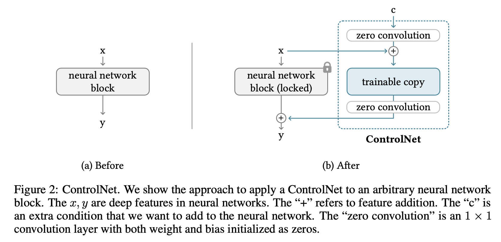
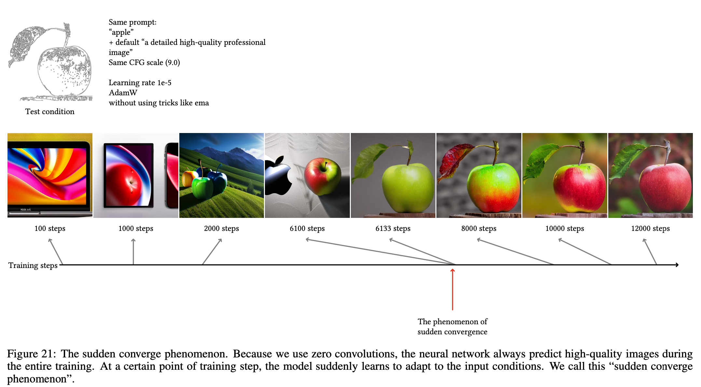

# Adding Conditional Control to Text-to-Image Diffusion Models
- Paper: https://arxiv.org/abs/2302.05543
- Github repo: https://github.com/lllyasviel/ControlNet

_**Canny Edges as the condition**_

_**Depth maps as the condition**_

> In the examples, you don't require fancy prompts. May be its the combination of condition and training data used for training. Maybe simple prompts used in training? 

## **Table of contents**
- [Adding Conditional Control to Text-to-Image Diffusion Models](#adding-conditional-control-to-text-to-image-diffusion-models)
  - [**Table of contents**](#table-of-contents)
  - [**Summary**](#summary)
  - [**Why do we need solutions like ControlNet?**](#why-do-we-need-solutions-like-controlnet)
  - [**Related work**](#related-work)
  - [Method](#method)
    - [**ControlNet**](#controlnet)
    - [**ControlNet in image diffusion model**](#controlnet-in-image-diffusion-model)
  - [**Training**](#training)
    - [**Type of training**](#type-of-training)
      - [**Default mode**](#default-mode)
    - [**Small-scale training**](#small-scale-training)
    - [**Large-scale training (_Clarify?_)**](#large-scale-training-clarify)
  - [**Experiments**](#experiments)
    - [**Experiment settings**](#experiment-settings)
  - [Examples](#examples)
    - [**Different input conditions**](#different-input-conditions)
    - [**Simple examples with high-modifications allowed**](#simple-examples-with-high-modifications-allowed)
    - [**Coarse control**](#coarse-control)
    - [**Comparison depth-maps**](#comparison-depth-maps)
    - [**Limitations**](#limitations)
    - [**Stable diffusion variants as base model**](#stable-diffusion-variants-as-base-model)
    - [**Image editing**](#image-editing)
    - [**Training data size**](#training-data-size)
  - [**Sudden Convergence Phenomenon**](#sudden-convergence-phenomenon)
  - [Starting experiment](#starting-experiment)

## **Summary**
- _**ControlNet**_, allows _**additional control**_ for the pre-trained large diffusion models, such as Stable diffusion, by providing the facility of input **visual** conditions such as edge maps, segment masks, depth masks, etc.
  
- They learns task-specific conditions in an end-to-end way
- The training is as fast as fine-tuning a diffusion model, and for small dataset (<50k), it can be trained to produce robust results even on desktop-grade personal GPUs.
- Alternatively, if powerful computation clusters are available, the model can scale to large amounts (millions to billions) of data.

## **Why do we need solutions like ControlNet?**
1. Firstly, many a times promps-level control is not able to capture and satisfy the user needs? We need to have a control that provides object-level or scene-level understanding to image generation problem, especially for specific image processing tasks.

2. Secondly, usually, for specific tasks, such as depth-to-image, pose-to-human, etc, we don't have data in billions! It is usually in thousands or at max in a single-digit million order. Therefore, we require robust neural network training method to avoid overfitting and to preserve generalization ability when the large models are fine-tuned for specific problems.

3. Thirdly, large computational resources are not always available for specific tasks. Therefore, we require fast training methods for optimizing large pre-trained models within an acceptable amount of time, memory and budget.

## **Related work**
- To do

## Method

### **ControlNet**
1. ControlNet is an end-to-end neural network architecture that controls large image diffusion models (like Stable Diffusion) to learn task-specific input conditions.

2. Using 2D feature as an example, given a feature map $x \in \mathbb{R}^{h \times w \times c}$, a neural network block $F (·; \theta)$ with a set of parameters $\theta$ transforms $x$ into another feature map $y$.

$$ y = F (\mathbf{x}; \theta)$$

> "network block" refers to a set of neural layers that are put together as a frequently used unit to build neural networks, e.g., “resnet” block, “conv-bn-relu” block, multi-head attention block, transformer block, etc.

3. The ControlNet clones the weights of a large diffusion model into a "trainable copy" ($\theta_c$) and a "locked copy" ($\theta$). The copied $\theta_c$ is trained with an external condition vector $c$. _**The locked copy preserves the network capability learned from billions of images, while the trainable copy is trained on task-specific datasets to learn the conditional control.**_

> The motivation of making such copies rather than directly training the original weights is to avoid overfitting when dataset is small and to preserve the production-ready quality of large models learned from billions of images.

> Since the production-ready weights are preserved, the training is robust at datasets of different scale.

4. The trainable and locked neural network blocks are connected with an unique type of convolution layer called "zero convolution", i.e., $1 \times 1$ convolution layer with both weight and bias initialized with zeros. The zero convolution operation are denoted as $\mathcal{Z}(·;·)$ and use two instances of parameters {$\theta_{z1}$, $\theta_{z2}$ } to compose the ControlNet structure with:

$$ y = F (\mathbf{x}; \theta) + \mathcal{Z}(F(x + \mathcal{Z}(c;\theta_{z2}); \theta_c);\theta_{z2})$$

> In zero convolution, weights progressively grow from zeros to optimized parameters in a learned manner.

> Since the zero convolution does not add new noise to deep features, the training is as fast as fine tuning a diffusion model, compared to training new layers from scratch.

> As long as the feature (image) is non-zero, the weights of the network will be optimized into non-zero matrix in the first gradient descent iteration. Notably, in this case, the feature term is input data or condition vectors sampled from datasets, which naturally ensures non-zero features. 

### **ControlNet in image diffusion model**
1. Stable Diffusion is used as an example to introduce the method to use ControlNet to control a large diffusion model with task-specific conditions.
2. Stable Diffusion is essentially an U-net with an encoder, a middle block, and a skip-connected decoder. Both the encoder and decoder have $12$ blocks, and the full model has $25$ blocks (including the middle block). In those blocks, $8$ blocks are down-sampling or up-sampling convolution layers, $17$ blocks are main blocks that each contains four resnet layers and two Vision Transformers (ViTs). Each Vit contains several cross-attention and/or self-attention mechanisms. 

3. The texts are encoded by OpenAI CLIP, and diffusion time steps are encoded by positional encoding.
4. Stable Diffusion uses a pre-processing method similar to VQ-GAN to convert the entire dataset of $512 × 512$ images into smaller $64 × 64$ “latent images” for stabilized training. 
5. This requires ControlNets to convert image-based conditions to $64 × 64$ feature space to match the convolution size. Here, a tiny network $E(·)$ of four convolution layers with $4 × 4$ kernels and $2 × 2$ strides (activated by ReLU, channels are 16, 32, 64, 128, initialized with Gaussian weights, trained jointly with the full model) to encode image-space conditions of $512 \times 512$ into feature maps of $64 × 64$.
6. Specifically, ControlNet creates the trainable copy of the $12$ encoding blocks and $1$ middle block of Stable Diffusion. The $12$ blocks are in $4$ resolutions ($64 × 64$, $32 × 32$, $16 × 16$, $8 × 8$) with each having 3 blocks. The outputs are added to the $12$ skip-connections and $1$ middle block of the U-net. 
7. Since SD is a typical U-net structure, this ControlNet architecture is likely to be usable in other diffusion models.

> Note, the ControlNet is computationally efficient: since the original weights are locked, no gradient computation on the original encoder is needed for training. This can speed up training and save GPU memory, as half of the gradient computation on the original model can be avoided. 

## **Training**
- On the surface, training is similar to any diffusion proces. Basically, the neural network is trained to predict the noise from the noisy image.
> Here, the image refers to the image in the latent space.

- Note, during the training, text prompts are randomly replaces by empty strings 50% of the time. This facilitates ControlNet’s capability to recognize semantic contents from input condition maps, e.g., Canny edge maps or human scribbles, etc. This is mainly because when the prompt is not visible for the SD model, the encoder tends to learn more semantics from input control maps as a replacement for the prompt.

### **Type of training**

####  **Default mode**
- In default mode, ControlNet is connected to “SD Middle Block” and “SD Decoder Block 1,2,3,4” as shown earlier.

### **Small-scale training**
- It can be used when computation device is limited. By disconnecting the link to decoder 1,2,3,4 and only connecting the middle block can improve the training speed by about a factor of 1.6. Moreover, when the model shows reasonable association between results and conditions, those disconnected links can be connected again in a continued training to facilitate accurate control.

### **Large-scale training (_Clarify?_)**
- This applies to the situation, when there are >1 million examples (e.g., edge maps) and sufficient compute is available. 
- Since the risk of over-fitting is relatively low, first train ControlNets for a large enough number of iterations (usually more than 50k steps), and then unlock all weights of the Stable Diffusion and jointly train the entire model as a whole. This would lead to a more problem-specific model.

## **Experiments**

### **Experiment settings**

- **CFG-scale** : 9.0 
- **Sampler**: DDIM 
- **Steps**: 20
- All captions are generated using BLIP model
- **Prompts**: 3 Types
  - **No prompt**:empty string “”
  - **Default prompt**: “a professional, detailed, high-quality image”
    > SD tends to generate random texture maps if no prompt is provided. It starts Hallucinating
  - **Automatic prompt**: BLIP generated captions (for fully automated pipeline)
  - **User-defined prompts**

## Examples

### **Different input conditions**

### **Simple examples with high-modifications allowed**

### **Coarse control**

### **Comparison depth-maps**

> They have trained the depth-map controlnet in two modes, small-scale and large-scale training (3M examples).

### **Limitations**

### **Stable diffusion variants as base model**
> _"Cartoon Line Drawing We use a cartoon line drawing extracting method [61] to extract line drawings from cartoon illustration from internet. By sorting the cartoon images with popularity, we obtain the top 1M lineart-cartoon-caption pairs. The model is trained with 300 GPU-hours with Nvidia A100 80G. The base model is Waifu Diffusion (an interesting community-developed variation model from stable diffusion [36])."_

> This shows, we can use our own SD-based model with their code to train a ControlNet.

### **Image editing**

### **Training data size**

> The **User-based sketching** and **Hough line** are trasfer learning examples where trained canny model is used as the starting point.

## **Sudden Convergence Phenomenon**

> _"You will always find that at some iterations, the model "suddenly" be able to fit some training conditions. This means that you will get a basically usable model at about 3k to 7k steps (future training will improve it, but that model after the first "sudden converge" should be basically functional). Because that "sudden converge" always happens, lets say "sudden converge" will happen at 3k step and our money can optimize 90k step, then we have two options: (1) train 3k steps, sudden converge, then train 87k steps. (2) 30x gradient accumulation, train 3k steps (90k real computation steps), then sudden converge. In my experiments, (2) is usually better than (1). However, in real cases, perhaps you may need to balance the steps before and after the "sudden converge" on your own to find a balance. The training after "sudden converge" is also important."_

## Starting experiment