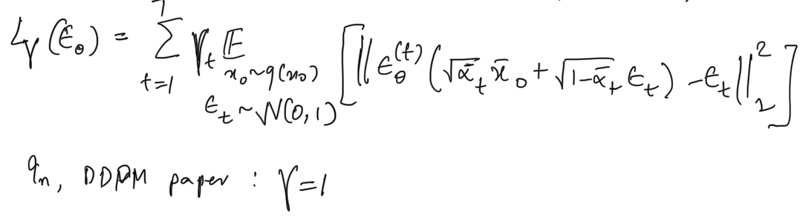

# Summary Notes (DDIM)

- Diffusion-based DDPM processes have demonstrated the ability to produce high-resolution samples comparable to GANs. However, one major drawback of these models is that require many iterations to produce an high-quality sample. For e.g., DDPM requires `1000` inference steps to produce a single sample. This is orders of magnitude slower than GANs that requires just one inference pass. 
- The paper present DDIMS which are implicit probabilistic models and can produce high quality samples **10X** to **50X** faster in terms of wall-clock time compared to DDPM. DDIMs can produce high-quality samples for as less as 50 time steps.

- DDIMs generalizes DDPMs by using a class of non-Markovian diffusion process that lead to sample training objective as of the DDPMs.
- These non-Markovian diffusion processes lead to "short" generative Markov chains that can simulate image generation in a small number of steps. 
- Moreover, the authors show, since the training objective in DDIM is similar to DDPM, one can use any pretrained DDPM model with DDIM or other generative processes that can generative images in least steps.
- Since there is no stochastic noise factor in DDIM sampling, they maintain the same high-level semantic information for different scheduling trajectories.

- This further allows for meaningful latent code interpolation and latent code inversion similar to GAN inversion.

## Notations
- $q(x_0)$ : the real data distribution
- $\bar{x}$ : a data point sampled from a real data distribution
- $\bar{x}_T$ : the final pure Gaussian noise $\mathcal{N}(\bar{x}_T; 0, \mathbf{I})$ after the forward diffusion proceess
- $q(\bar{x}_{1:T} | \bar{x}_{0})$ : forward diffusion process
- $p_\theta(\bar{x}_{0:T})$ : reverse diffusion process
- $\beta_t$ : the fixed variance schedule in the diffusion process
- $\alpha_t=1-\beta_t$ and $\bar{\alpha}_t = \prod_{i=1}^{t} \alpha_i$

## Recap of DDPM

### Forward diffusion process following Markov chain with Gaussian transitions
From DDPM paper,

This can further be reduces as:

Thus, $\bar{x_t}$ can be represented as:

### Reverse diffusion process (generative process)

Here, $\theta$ are learnt parameters to fit $q(x_0)$ by maximizing the variational lower bound: 

Making the different assumptions and assuming trainable fixed means and variances for all the conditional Gaussians:

## Non-Markovian process

## Non-Markovian forward process
The DDPM objective in the form of Lγ only depends on the marginals $q(\bar{x}_t|\bar{x}_0)$, but not directly on the joint $q(\bar{x}_{1:T}|\bar{x}_0)$. Since there are many inference distributions (joints) with the same marginals, the inference processes can be expressed as an non-Markovian, which leads to new generative processes. 

## Non-Markovian generative process

## Unified variational inference objective

> **Note, they show ${J}_{\sigma}$ is equivalent to $L_{\gamma}$ for certain weights $\gamma$. Thus, non-Markovian inference process
lead to the same surrogate objective function as DDPM.**

> "With L1 as the objective, we are not only learning a generative process for the Markovian inference process considered in Sohl-Dickstein et al. (2015) and Ho et al. (2020), but also generative processes for many non-Markovian forward processes parametrized by σthat we have described. Therefore, we can essentially use pretrained DDPM models as the solutions to the new objectives, and focus on finding a generative process that is better at producing samples subject to our needs by changing $\sigma$"

## DDIM
Sampling procedure:

Fo $\sigma = 0$ for all $t$; the forward process becomes deterministic given $x_{t−1}$ and $x_0$, except for $t = 1$; in the generative process, the coefficient before the random noise  becomes zero. The resulting model becomes an implicit probabilistic mode, where **samples are generated from latent variables with a fixed procedure** (from $x_T$ to $x_0$). Thus model is called the **denoising diffusion implicit model (DDIM)**, because it is an implicit probabilistic model trained with the DDPM objective (despite the forward process no longer being a diffusion).

Note, when ${\sigma}_t = \sqrt{\frac{1-\bar{\alpha}_{t-1}}{1-\bar{\alpha}_{t}}}\sqrt{1 - \frac{\bar{\alpha}_t}{\bar{\alpha}_{t-1}}}$
the forward process becomes Markovian, and the generative process becomes a DDPM.

The authors also shows one can train a model with an arbitrary number of forward steps but only sample from some of them in the generative process. Therefore, the trained model could consider many more steps than what is considered in (Ho et al., 2020) or even a continuous time variable t (Chen et al., 2020).

## DDIM Inversion
The DDIM sampling equation can be written as simple ordinary differential equation as follows:

In the limit of discretization steps, one can reverse the generation process, which encodes $\bar{x_0}$ to $\bar{x_T}$ and simulates the reverse of the ODE. Thus, unlike DDPM, one use DDIM to obtain encodings of the observations, which is useful for downstream applications that requires latent representations.

We can't do the similar inversion to generate the latent code using DDPM due to its stochastic nature.

## Examples
For the examples, $\sigma$ is defined as:
${\sigma}_t = \eta\sqrt{\frac{1-\bar{\alpha}_{t-1}}{1-\bar{\alpha}_{t}}}\sqrt{1 - \frac{\bar{\alpha}_t}{\bar{\alpha}_{t-1}}}$
Here, $\sigma$ controls the stochasticity, which is controled using $\eta$ (0: DDIM, 1: DDPM)

- DDIM ($\eta$ = 0) achieves the best sample quality when dim(τ) is small, and DDPM ($\eta$ = 1) typically has worse sample quality compared to less stochastic countarparts, especially for smaller time steps schedule. 
- The generated images with the same initial $\bar{x}_T$, has most high-level features similar, regardless of the different generative trajectory.

- The high level features of the DDIM sample is encoded by $\bar{x}_T$ without any stochastic influence, thus there is similar meaningful semantic interpolation effect.

- The DDIM inversion can be used to generate the latent code of the input image.
