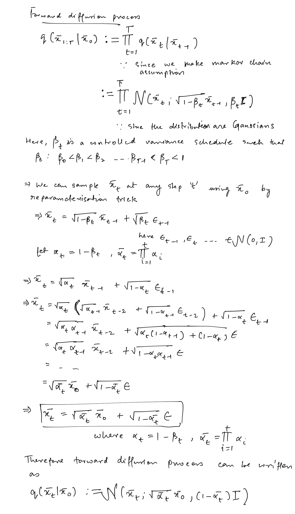
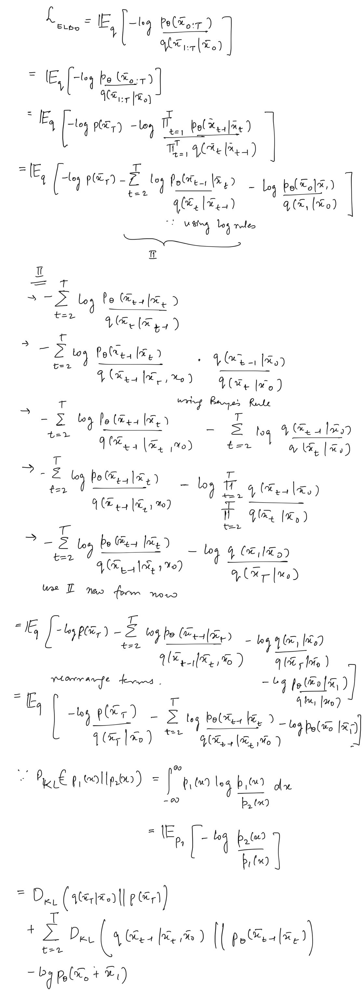
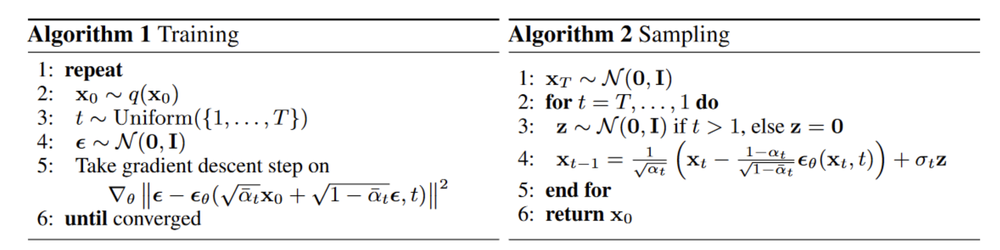

# Summary Notes (DDPM)

## Introduction
- As mentioned in the diffusion models introduction, a (denoising) Diffusion model is a kind of generative model that is used to generate data similar to the data it is trained on. 
- Fundamentally, a diffusion process consists of two prominenet steps:
  - A fixed or pre-defined _**Forward diffusion process**_ that gradually adds noise (Gaussian in DDPM case) to an input image, until we end up with pure noise.
  - A learned _**reverse diffusion process**_ (denoising) where we train a neural network to gradually denoise an image starting from pure noise which is equivalent to sampling from the estimated data distribution.

## Notations
- $q(x_0)$ : the real data distribution
- $\bar x$ : a data point sampled from a real data distribution
- $\bar x_T$ : the final pure Gaussian noise $\mathcal{N}(\bar x_T; 0, \mathbf{I})$ after the forward diffusion proceess
- $q(\bar x_{1:T} \vert \bar x_{0})$ : forward diffion process
- $\beta_t$ : the fixed variance schedule in the diffusion process

## Forward diffusion process
For a sample $\bar x_0$ from the given real distribution, $q(x_0)$, we define a forward diffusion process, $q(\bar x_{1:T} \vert \bar x_{0})$, in which we add small amount of Gaussian noise to the $\bar x_0$ in $T$ steps, producing a sequence of noisy samples $\bar x_1$, $\bar x_2$,..., $\bar x_T$, according to a pre-defined variance schedule $\{\beta_t \in (0,1) \}_{t=1}^{T}$. The data sample gradually loses its features as the steps approaches $T$ such that $\bar x^T$ is equivalent to isotropic Gaussian noise. 

As the forward process is a Markov chain, therefore:

$$q(\bar x_{1:T} \vert \bar x_{0}) = \prod_{t=1}^{T}q(\bar x_{t} \vert \bar x_{t-1})$$

Since, the distributons are Gaussians:
$$q(\bar x_{t} \vert \bar x_{t-1}) = \mathcal{N}(\bar x_t; \sqrt{1-\beta_t}\bar x_{t-1}, \beta_t\mathbf{I})$$

The $\bar x_t$ can also be sampled using $\bar x_0$ as follows:

$$q(\bar x_{t} \vert \bar x_{0}) = \mathcal{N}(\bar x_0; \sqrt{\bar \alpha_t} \bar x_{0}, (1-\bar \alpha_t)\mathbf{I})$$

Here, $\alpha_t=1-\beta_t$ and $\bar \alpha_t = \prod_{i=1}^{t} \alpha_i$.

The following shows how to derive the forward diffusion process.

## Reverse diffusion process
If we know the $p(\bar x_{t-1} \vert \bar x_{t})$ conditional process, then we can reverse the forward process starting from pure noise and gradually "denoising" it so that we end up with a sample from the real distribution.

However, it is intractable and requires knowing the actual data distribution of the images in order to calculate this conditional probability. Hence, we use a neural network $p_\theta$ to approximate (learn) the $p_{\theta}(\bar x_{t-1} \vert \bar x_{t})$ conditional probability distribution.

Starting with the pure Gaussian noise $p(\bar x_T) = \mathcal{N}(\bar x_T; 0, \mathbf{I})$, assuming the reverse process to be Gaussian and Markov, the joint conditional ditribution $p_{\theta}(\bar x_{0:T})$ is given as follows:

$$ p_{\theta}(\bar x_{0:T}) = p(\bar x_T) \prod_{t=1}^{T}p_\theta(\bar x_{t-1} \vert \bar x_{t}) $$

$$ p_{\theta}(\bar x_{0:T}) = p(\bar x_T) \prod_{t=1}^{T} \mathcal{N}(\bar x_{t-1}; \mu_{\theta}(\bar x_t,t), \Sigma_{\theta}(\bar x_t,t))$$

Here, the time-dependent Gaussian parameters ($\mu_{\theta}$ and $\Sigma_{\theta}$) are learned.

## Training $p_\theta$
In order to find the optimal paramters ($\theta$), we need to maximize the likelihood of training data:

$$ \theta' = \underset{\theta \in \Theta }{argmax}\ p_\theta(\bar x_{0:T})$$

Therefore, we must minimize:

$$L = E_{\bar{x_0}\sim D}[-log\ p_\theta(\bar x_0)]$$

Similars to VAEs, minimizing the above loss function is equivalent to minimizing the variational lower bound ($ELBO$: evidence lower bound objective).

$$E_{\bar x_0 \sim D}[-log\ p_\theta(\bar x_0)] \leq E_{q}[-log\ \frac{p_\theta(\bar x_{0:T})}{q(\bar x_{1:T}|\bar x_0)}]$$

$$L_{ELBO​} = E_{q}[-log\ \frac{p_\theta(\bar x_{0:T})}{q(\bar x_{1:T}|\bar x_0)}]$$

Through some simplifications, it is possible to rewrite $L_{ELBO}$ almost completely in terms of KL divergences:

$$L_{ELBO​} = L_0 + L_1 + L_2 + L_3 .. + L_{t} + ... + L_{T-1} + L_{T}$$

$$L_0 = -log\ p_\theta(\bar{x_0}|\bar{x_1}) $$

$$L_t = D_{KL}(q(\bar x_{t-1}|\bar{x_t}, \bar x_0) \ \|\ p_\theta(\bar x_{t-1}|\bar{x_t}))$$

$$L_T = D_{KL}(q(\bar x_{T}|\bar{x_0}) \ \|\ p(\bar x_{T}))$$

The following shows how to rewrite $L_{ELBO}$ almost completely in terms of KL divergencess.

### $L_{T}$ 
$L_T$ is a constant and can be ignored during training since $q$ has no learnable parameters and $\bar x_T$ is a Guassian noise.

### $L_0$ (Need to review again)
The reverse process consists of transformations under continuous conditional Gaussian distributions. However, we want to produce an image at the end of the reverse diffusion process which has integer pixel values. Therefore, at the last reverse steps we need to obtain discrete integer (log) likelihood values for each pixel.

This is done by setting the last transition ($L_0$) in the reverse diffusion chain to an independent discrete decoder.

$$ L_0 = -log\ p_\theta(\bar{x_0}|\bar{x_1}) $$

First, the authors impose the independence between the data dimensions. This allows the following parameterization:

$$p_\theta(\bar{x_0}|\bar{x_1}) = \prod_{i=1}^{D} p_\theta(\bar{x_0}^i|\bar{x_1}^i)$$

Here, $D$ is the dimensionality of the data. Thus, the multivariate Gaussian 
for step $\bar x_1$ to $\bar x_0$ can be written as product of univariate Gaussians for each value of D.

$$ \mathcal{N}(\bar x; \mu_\theta(\bar x_1,1), \sigma_1^2\mathbb{I}) =  \prod_{i=1}^{D} \mathcal{N}(\bar x; \mu_\theta^i(\bar x_1,1), \sigma_1^2) $$ 

The probability of a pixel value for $\bar x_0$, given the univariate Gaussian distribution of the corresponding pixel in $\bar x_1$, is the area under that univariate Gaussian distribution within the bucket centered at the pixel value. This can be written as follows:

$$ p_\theta(\bar{x_0}|\bar{x_1}) = \prod_{i=1}^{D} \int_{\delta-{\bar x_0^i}}^{\delta+{\bar x_0^i}} \mathcal{N}(\bar x; \mu_\theta^i(\bar x_1,1), \sigma_1^2) $$

where, $\delta-{\bar x_0^i}$ is given as follows:
$$\delta-{\bar x_0^i} = -\infty \ \ \ for \ \ \ \bar x=-1;$$
$$\delta-{\bar x_0^i} = \bar x - \frac{1}{255} \ \ \ for \ \ \  \bar x > -1$$

and $\delta+{\bar x_0^i}$ is given as follows:

$$ \delta+{\bar x_0^i} = \infty \ \ \ for \ \ \ \bar x=1;$$
$$ \delta+{\bar x_0^i} = \bar x - \frac{1}{255} \ \ \ for \ \ \ \bar x < 1$$

Note, the authors make the following assumptions:
1. The images consist of integers between [0,255]
2. The images are scaled linearly to [-1,1]

### $L_{1:T-1}$
The reverse Markov process is defined as follows:

$$ p_{\theta}(\bar x_{t-1}|\bar x_t) = \mathcal{N}(\bar x_{t-1}; \mu_{\theta}(\bar x_t,t), \Sigma_{\theta}(\bar x_t,t))$$

We need the function forms of $\mu_\theta$ and $\Sigma_\theta$. In the paper, the $\Sigma_\theta$ is defined as follows:

$$ \Sigma_\theta(\bar x_t, t) = \sigma_t^2\mathbb{I} $$
$$ \sigma_t^2 = \beta_t$$

Basically, we are making the following assumptions:
1. The multivariate Gaussian is a product of independent gaussians with identical variance.
2. The variance value can change with time. 
3. These variances to be equivalent to the forward process variance schedule.

This leads to:

$$p_{\theta}(\bar x_{t-1}|\bar x_t) = \mathcal{N}(\bar x_{t-1}; \mu_{\theta}(\bar x_t,t), \sigma_t\mathbf{I})$$

This transforms:
$$L_t = D_{KL}(q(\bar x_{t-1}|\bar{x_t}, \bar x_0) \ \|\ p_\theta(\bar x_{t-1}|\bar{x_t}))$$
to 
$$L_t = \mathbb{E_q}[\frac{1}{2\sigma_t^2}\| \tilde{\mu}(\bar x_t, \bar x_0) - {\mu}_{\theta}(\bar x_t, t) \|^2] + C$$

The above expressions is _MSE_ loss between the reverse process posterior mean and the forward process posterior mean. Thus, training a neural network for the reverse process simply means predicting the
mean for the forward process.

Training to predict $\mu_\theta$ leads to unstable trainig. Since, Because $\bar x_t$ is available as input during training time, we can reparameterize the Gaussian noise term and instead train the network to predict noise ($\epsilon_t$) by using:

$$\tilde{\mu}_t = \frac{1}{\sqrt{\sigma_t}}(\bar x_t - \frac{1-\alpha_t}{\sqrt{1-\bar \alpha_t}}\epsilon_t)$$

Thus, the loss term $L_t$ reduces:
$$L_t = \mathbb{E_q}[\frac{1}{2\sigma_t^2}\| \tilde{\mu}(\bar x_t, \bar x_0) - {\mu}_{\theta}(\bar x_t, t) \|^2] + C$$

$$L_t = \mathbb{E_{t,0,\epsilon}}[\frac{1}{2\sigma_t^2}\|  \frac{1}{\sqrt{\sigma_t}}(\bar x_t - \frac{1-\alpha_t}{\sqrt{1-\bar \alpha_t}}\epsilon_t) - \frac{1}{\sqrt{\sigma_t}}(\bar x_t - \frac{1-\alpha_t}{\sqrt{1-\bar \alpha_t}}\epsilon_\theta(\bar x_t, t)) \|^2] + C$$

$$L_t = \mathbb{E_{t,0,\epsilon}}[\frac{(1-\alpha_t)^2}{2\alpha_t\sigma_t^2}\|  \epsilon_t - \epsilon_\theta(\bar x_t, t) \|^2] + C$$

$$L_t = \mathbb{E_{t,0,\epsilon}}[\frac{(1-\alpha_t)^2}{2\alpha_t\sigma_t^2}\|  \epsilon_t - \epsilon_\theta(\sqrt{\bar \alpha_t}\bar x_0 - \sqrt{1-\bar \alpha_t}\epsilon_t, t) \|^2] + C$$

Empirically, thy also found that training the diffusion model works better with a simplified objective that ignores the weighting terms. Thus, leading to:

$$L_{t,simple} = \mathbb{E_{t,0,\epsilon}}[\|  \epsilon_t - \epsilon_\theta(\sqrt{\bar \alpha_t}\bar x_0 - \sqrt{1-\bar \alpha_t}\epsilon_t, t) \|^2] + C$$

The training and sampling algorithms for the Diffusion Model can be summarized as follows:

### Network architecture
The only requirement for the neural network is that its input and output dimensionality remain identical. Given this restriction, it is perhaps unsurprising that diffusion models are commonly implemented with U-Net-like architectures.

### Experimentation setup (paper)
1. Timesteps for diffusion proces: $T$ = 1000
2. Beta schedule for noise: $\beta_1$ = $10^{−4}$ linearly increases to  $\beta_T$ = $0.02$
3. Model is a modified U-net, parameters shared across time
4. timesteps specified via a sinusoidal position embedding
5. Training with Adam and used EMA
6. Horizontal flips for CIFAR10

## Acknowlegements and references
- [Assembly AI blog post on DDPMs](https://www.assemblyai.com/blog/diffusion-models-for-machine-learning-introduction/)
- [Lillian's Weng post on diffusion models](https://lilianweng.github.io/posts/2021-07-11-diffusion-models/#speed-up-diffusion-model-sampling)
- [Huggingface DDPM blogpost](https://huggingface.co/blog/annotated-diffusion)
- [Yannic Kilcher Video on DDPMs](https://www.youtube.com/watch?v=W-O7AZNzbzQ)

