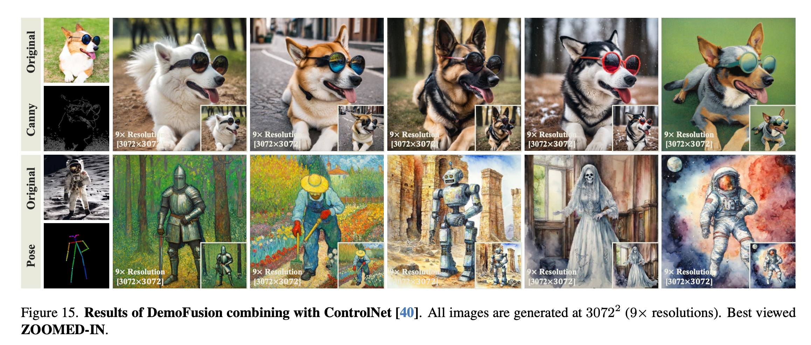

# Summary Notes (DemoFusion)

- DemoFusion framework for democratizing high-resolution image generation using open-source LDM models such as SD/SDXL. 
- It focuses on producing high-resolution images to generate images at `4X`, `16X`, and even higher resolutions without any fine-tuning or prohibitive memory demands.
- It employs techniques such as **Progressive upscaling**, **Skip residuals** and **Dilated sampling** to generate high-resolution images.

## Introduction
- Training high-resolution image generation models, like Stable Diffusion, Mid-journey, Dalle, demands substantial resources, including hardware, data and energy. Thus, there is a trend where companies limit access to these advanced models, often placing them behind paywalls.
- DemoFusion aims to re-democratize Generative AI (GenAI) image synthesis by enabling higher resolution image creation, surpassing the 1024² limit of models like SDXL, Midjourney, and DALL-E, reaching resolutions of 4096² or more.
- It is capable of running on a single consumer-grade RTX 3090 GPU without needing extra training, making high-resolution image generation more accessible but **requiring more time.**
- Open-source LDMs already contain sufficient prior knowledge to generate high-resolution imges, DemoFusion leverages it existing by fusing multiple such high-resolution patches into a complete scene.
- However, achieving coherent high-resolution images using patch-wise generation is challenging. For example, MultiDiffusion demonstrated potential in panoramic images but struggled with high-resolution, object-centric images due to lack of global coherence.
- DemoFusion utilizes a pre-trained SDXL model and introduces three key mechanisms for coherence and detail: 
  - **Progressive upscaling** for coherent structure.
  - **Skip residuals** for global guidance.
  - **Dilated sampling** for global context.
- These techniques improve image quality but increase runtime; higher resolutions particularly require more time due to the exponential increase in processing with resolution, although the memory cost remains manageable on consumer-grade GPUs.

## Methodoloy

### MultiDiffusion
- MultiDiffusion extends Latent Diffusion Models (LDMs) for creating high-resolution panoramic images using an overlapped patch-based denoising process. 
- It operates in a defined latent space and uses a shifted crop sampling method to produce local latent representations. These representations are then denoised independently and reconstructed into the original size, with overlaps averaged to mitigate seam issues.

### 1. Progressive upscaling
- DemoFusion addresses the lack of global semantic coherence in patch-wise high-resolution image generation by modifying the inference process of SDXL.
- It introduces Progressive Upscaling, which starts with low-resolution synthesis and incrementally increases resolution, enhancing detail without losing coherence.

- The approach aims to produce images at a resolution magnified by a factor of $K$, where the scaling factor for the side length is $S = \sqrt{K}$. Consequently, the target latent space dimensions are expanded to $ R^{c \times H \times W} $ where $ H = Sh$ and $W = Sw$ from  $R^{c \times h \times w}$.

- Instead of directly synthesizing in the higher dimension latent space $ R^{c \times H \times W} $, the image generation is divided into $ S $ distinct phases. Each phase consists of an **upsample-diffuse-denoise** loop.

- Note, the first phase is different and follows an **initialise-denoise** scheme, where the initial latents are initialized and denoised to product the image:
  
-  For each subsequent scale $ s $, the process involves:
    - Upscaling the low-resolution image $ z_{s-1}^{0} $ to $ z_{s}^{'0} $ (bicubic interpolation),
    - Reintroducing noise through the diffusion process to get $ z_{s}^{'T} $,
    - Denoising to achieve $ z_{s}^{0} $.

- This iterative loop allows the model to enhance details progressively, compensating for any losses due to artificial interpolation in upsampling.

### 2. Skip-residual
- Directly diffusing the upscaled image $ z_s^0 $ to $ z_s^{'T} $ could lead to significant information loss. It's difficult to determine the optimal intermediate time-step $ t $ in the "upsample-diffuse-denoise" loop where denoising should start.

- The larger the $t$, the more infor- mation is lost, which weakens the global perception; the smaller the $t$, the stronger the noise introduced by upsampling

- To address this, DemoFusion introduces skip residuals as a general solution. It involves a weighted fusion of multiple loops with different intersection time-steps $ t $, utilizing noise-inversed versions of $ z_s^0 $ obtained during the generation phase.

- The process modifies the denoising step by introducing:
  
  $$ \hat{z}_t = c_1 \times z_t + (1 - c_1) \times z_s^{'t}, $$
  
  where $ c_1 = \left( \frac{1 + \cos\left( \frac{2\pi t}{T} \right)}{2} \right)^{\alpha_1} $ is a scaled cosine decay factor with scaling factor $ \alpha_1 $.

- This method uses results from previous phases to guide the global structure of the generated image in the initial steps of the denoising process.

- As the denoising progresses, the influence of the noise residual is reduced, allowing the local denoising paths to more effectively optimize the finer details.

### 3. Dilated sampling

- Dilated Sampling technique involves expanding the receptive field of convolutional kernels, commonly used in dense prediction tasks. DemoFusion adapts this concept not by dilating the convolutional kernels but by dilating the sampling within the latent representation.

- Shifted dilated sampling is used to obtain global latent representations $ Z_{\text{global}} $, with a dilation factor set to $ s $ and $ M = s^2 $, indicating that the sampling is squared in accordance to the dilation factor.

- The global denoising paths, obtained through dilated sampling, are processed similarly to local paths in MultiDiffusion. They are then fused with the reconstructed local representations to form the final latent representation:

  $$ z_{t-1} = c_2 \times R_{\text{global}}(Z_{\text{global}}) + (1 - c_2) \times R_{\text{local}}(Z_{\text{local}}), $$

  where $ c_2 = \left(\frac{1 + \cos\left(\frac{2\pi t}{T}\right)}{2}\right)^{\alpha_2} $ is the scaled cosine decay factor with scaling factor $ \alpha_2 $.

- Note, the direct use of dilated sampling can result in grainy images, as global paths do not overlap like local paths. To solve this, a Gaussian filter $ G(\cdot) $ is applied to the latent representation before sampling:

  $$ Z_{\text{global}} = S_{\text{global}}(G(z_t)). $$

  The Gaussian filter's kernel size is set to $ 4s - 3 $, which is deemed sufficient for each phase of the process.

- The standard deviation of the Gaussian filter decreases progressively from $ \sigma_1 $ to $ \sigma_2 $ using the equation:

  $$ \sigma = c_3 \times (\sigma_1 - \sigma_2) + \sigma_2, $$

  where $ c_3 = \left(\frac{1 + \cos\left(\frac{2\pi t}{T}\right)}{2}\right)^{\alpha_3} $ is another scaled cosine decay factor with scaling factor $ \alpha_3 $. This ensures that the filtering effect reduces over time, allowing the global denoising paths to become more consistent and preventing the final image from blurring.

### Experimental setup
- DDIM scheduler of 50 steps.
- Guidance scale: 7.5
- Crop size in MultiDiffusion aligns with LDMs' maximum training size, e.g., $ h = w = 128 $ for SDXL, with strides $ d_h = \frac{h}{2} $, $ d_w = \frac{w}{2} $.
- Crops are slightly randomly perturbed with max offsets $ \frac{h}{16} $ and $ \frac{w}{16} $ to avoid seams.
- For varying aspect ratios, the longer side aligns with the maximum training size.
- Scale factors $ \alpha_1, \alpha_2, \alpha_3 $ are set to 3, 1, and 1, respectively.
- Gaussian filter's standard deviation decreases from $ \sigma_1 = 1 $ to $ \sigma_2 = 0.01 $.
- A tiled decoder strategy is employed for high-resolution image decoding.

## Examples

## Limitations
- DemoFusion requires a high computational load for inference due to overlapped denoising paths and extended inference times due to progressive upscaling.
- Its performance is tied to the underlying LDM, and while effective, it varies with different LDM versions. Also, It relies on LDMs' knowledge of cropped images, which can lead to irrational content in sharp close-up images.

## Ablation Studies

### Progressive upscaling process
- DemoFusion maintains global consistency under different resolutions

### Stride sizes $d_h$ and $d_w$
-  The stride size $d_h$ and $d_w$ in MultiDiffusion determines the extent of the seam issue of images, a smaller stride means more seamless images, but at the same time, brings more overlapping computation.
-  Due to progressive upscaling and dilated sampling in demofusion, the large striding of 1/2 also works.

### Diffusing to Different Time-step $t$

### Scale factors $\alpha_1$, $\alpha_2$ and $\alpha_3$

### Effect of all three techniques

### Resource used in demofusion in comparison to SDXL

