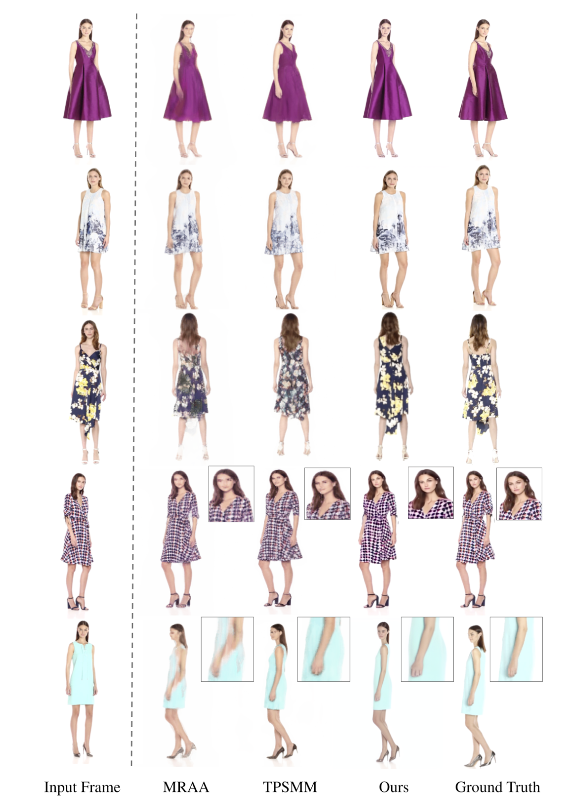

# Summary Notes (DreamPose)

- Fashion photography, unlike videos, is limited in the information they convey, and fail to capture many of the crucial nuances of a garment, such as how it drapes and flows when worn.

- In this paper, authors introduce DreamPose, a method that turns fashion photographs into realistic, animated videos, using a driving pose sequence. The method is a diffusion video synthesis model based upon Stable Diffusion. Given one or more images of a human and a pose sequence, DreamPose generates a high-quality video of the input subject following the pose sequence.

- As mentioned before, DreamPose is fine-tuned from an existing pretrained image diffusion model, which already effectively models the distribution of natural images. **_When using such a model, the task of image animation can effectively be simplified to finding the subspace of natural images consistent with the conditioning signals._** 

- **To accomplish this, the authors redesign the encoder and conditioning mechanisms of the Stable Diffusion architecture, in order to enable aligned-image and unaligned-pose conditioning.**

> Note, video diffusion models suffers from “textural” motion, cartoon-like appearance or temporal consistency. This is partly because existing models are primarily conditioned on text, as opposed to other conditioning signals (e.g., motion) which may offer more fine-grained control. In contrast, Dreampose's image-and-pose conditioning schemes allows for greater appearance fidelity and frame-to-frame consistency.

- Contributions:
    1. DreamPose: an image-and-pose conditioned diffusion method for still fashion image animation, 
    2. a simple, yet effective, pose conditioning approach that greatly improves temporal consistency across frames
    3. a split CLIP-VAE encoder that increases the output fidelity to the conditioning image
    4. a finetuning strategy that effectively balances image fidelity and generalization to new poses.

## Some papers mentioned in paper (might be useful)
- [**DiffFashion**](https://arxiv.org/abs/2302.06826): edits a clothing item by transferring the style of a reference image
- [**PIDM**](https://arxiv.org/abs/2211.12500): generates pose-conditioned human images. It encodes image textures using a separate textural encoder and concatenates target pose with an input noisy image. However, the method does not optimize for temporal consistency. 
- [**Tune-a-video**](https://arxiv.org/abs/2212.11565): It finetunes a text-to-image pretrained diffusion model for text-and-image conditioned video generation.
- [**Motion Representations for Articulated Animation (MRAA)**](https://openaccess.thecvf.com/content/CVPR2021/papers/Siarohin_Motion_Representations_for_Articulated_Animation_CVPR_2021_paper.pdf): one of the conditional video synthesis methods
- [**Thin-Plate Spline Motion Model (TPSMM)**](https://github.com/yoyo-nb/Thin-Plate-Spline-Motion-Model): one of the conditional video sythesis methods

## Method
The Dreampose takes an input image $x_o$ and poses ${p_1,p_2...p_N}$
### Architecture
- The DreamPose model is a pose- and image-conditioned image generation model that modifies and finetunes the original text-to-image Stable Diffusion model for the purpose of image animation
- Therefore, the image and pose-conditioning should be added to the stable diffusion model

### Image conditioning using split CLIP-VAE encoder
- In Dreampose, the network outputs are not spatially aligned with the input image. Therefore, one cannot contatenate the image with the input noise as in the case of InstructPix2Pix.
- Note, the CLIP model encodes both text and images to a shared embedding space. It may seem natural to simply replace the CLIP conditioning with the embedding derived from the conditioning image.
- However, this in practice is insufficient for capturing fine-grained
details in the conditioning image. 
- So, instead VAE encoder latent embeddings are added along with CLIP image embeddings as image conditioning
- These embeddings are combined and added using an Adapter Module. This adapter blends both the signals together and transforms the output into the typical shape expected by the cross-attention modules of the denoising U-Net. 
  $c_I = A(c_{CLIP}, c_{VAE})$
- The weights corresponding to the VAE embeddings are set to zero, so as to mitigate network “shock” in training.

### Pose-conditioning using a modified UNet
- Unlike the image conditioning, the pose conditioning is image-aligned. 
- The target pose representation  are concatenated with noisy latents as the input to the UNET. 
- The UNet is modified to take 10 extra input channels, initialized to zero, while the original channels corresponding to the noisy latents are unmodified from the pretrained weights.
> Note, to account for noise in the poses and to maximize temporal consistency in the generated frames, cp consist of five consecutive pose frames.

### Finetuning

- DreamPose is finetuned in two stages.
- The first phase fine-tunes the UNet and adapter module on the full training dataset in order to synthesize frames consistent with an input image and pose. 
- The second phase refines the base model by finetuning the UNet and adapter module, then the VAE decoder, on one or more subject-specific input image(s) to create a subject-specific custom model used for inference.
> sample-specific finetuning is essential to preserving the identity of the input image’s person and garment, as well as maintaining a consistent appearance across frames. However, simply training on a single frame and pose pair quickly leads to artifacts in the output videos,

> Moreover, finetuning the VAE decoder is crucial for recovering sharper, more photorealistic details in the synthesized output frames. 

### Pose and Image Classifier-Free Guidance
- At inference time, a video is generated frame-by-frame from a single input image and a sequence of poses using the subject-specific model.
- The strength of image-conditioning and pose conditioning is controlled using dual classifier-free guidance during inference.

$$ \epsilon_\theta(z_t, c_I, c_p) = \epsilon_\theta(z_t, \phi, \phi) + s_I(\epsilon_\theta(z_t, c_I, \phi)-\epsilon_\theta(z_t, \phi, \phi)) + s_p(\epsilon_\theta(z_t, c_I, c_p)-\epsilon_\theta(z_t, c_I, \phi)) $$
- The decoupled classifier-free guidance prevents overfitting to the one input pose after subject-specific finetuning

### Implementation details
- Train and test datasets come from the UBC Fashion dataset. Train: 339 video and test: 100 test videos. Each videos has 30 f/s and is 12 s long.
- Dropout of around 5% is used during the first phase both for image and pose.

## Results
### Comparisons

DreamPose results on unseen samples from the DeepFashion dataset. Despite being trained exclusively on the UBC Fashion Dataset, the method generalizes to new garments and model identities after subject-specific finetuning of the base model.

DreamPose as a pose-transfer tool

### Increasing the number of input images for fine-tuning

### Failure cases
For some examples, limbs disappear into the fabric, hallucinated dress features, and directional misalignment when the target pose is facing backwards. These failures could be alleviated with improved pose estimation, a larger dataset, or a segmentation mask. 

