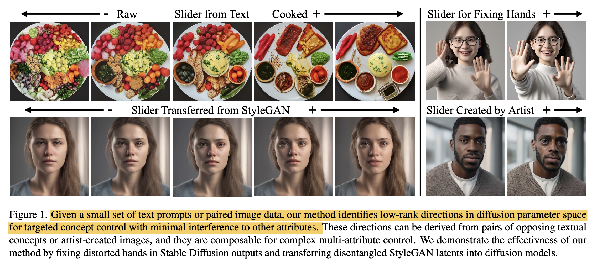

# Summary Notes (Lora Sliders)

## Gist of the paper

-  The paper presents Concept Sliders, which are low-rank LoRA adaptors that enable fine-grained, continuous control over specific visual attributes in images generated by diffusion models. 

- This method allows for nuanced editing and manipulation of images beyond what is achievable with text prompts alone.

- The sliders work by learning low-rank parameter directions that modulate the likelihood of specific image attributes. 

- This approach offers precision control over the generation process, enabling artists and creators to adjust complex visual concepts with minimal interference.

- The sliders are modular, composable, and can be overlaid on existing models without degrading output quality.

## Introduction

- The paper addresses the need for finer control over visual attributes and concepts in images generated by text-to-image diffusion models, which is a demand particularly pronounced among artistic users. 
- Existing methods using text prompts provide limited control, making it challenging to precisely modulate continuous attributes like a person’s age or the intensity of weather, thus hindering creators' ability to match their artistic vision. 
- To overcome these limitations, the paper introduces **"Concept Sliders"**, interpretable plug-and-play adaptors that allow for nuanced editing within diffusion models. 
- These sliders empower creators with high-fidelity control over the generative process and image editing, offering precise, continuous control over desired concepts in a single inference pass with efficient composition and minimal entanglement.
- Concept Sliders represent a significant advancement over previous methods. Direct prompt modification, while capable of controlling many image attributes, often leads to drastic changes in the overall image structure.
- In contrast, post-hoc techniques like PromptToPrompt and Pix2Video enable editing of visual concepts in images but require separate inference passes for each new concept and can only support a limited number of simultaneous edits. 
- Concept Sliders, however, are designed as low-rank modifications of the diffusion model, ensuring precision in controlling concepts while maintaining high-quality, disentangled editing. 
- This method also allows editing visual concepts that are difficult to capture through textual descriptions, thus offering a new realm of possibilities for image manipulation and generation.
-  The sliders are lightweight and can be easily shared and overlaid on diffusion models. This enables users to adjust multiple sliders simultaneously for complex image generation.

## Related works
- **Instruct-pix2pix** by Tim Brooks et al. (2022) introduced fine-tuning of a diffusion model to condition image generation on both an input image and text prompt, enabling a wide range of text-guided editing but lacking fine-grained control over visual concepts not easily described textually.

- Ho et al. (2022) and Liu et al. (2022) demonstrated improved image quality and text-image alignment through guidance terms during inference, enhancing concept composition and negation in diffusion models.

- **Custom Diffusion** by Nupur Kumari et al. (2023): Proposed incorporating new visual concepts into pretrained diffusion models by finetuning only the cross-attention layers.

- **Discovering Interpretable Directions in Diffusion Models** by Haas et al. (2023) highlighted that principal directions in diffusion model latent spaces capture global semantics, with the method directly training low-rank subspaces corresponding to semantic attributes.

## Method

### LORA
- LoRA operates by decomposing the weight update (∆W) during the fine-tuning of a pre-trained model. This is based on the idea that significant model changes can be represented as low-rank modifications, which means they can be captured in a smaller, more manageable subspace of the model's parameters. Given a pre-trained model layer with weights $ W_0 \in \mathbb{R}^{d \times k} $ (where $ d $ is the input dimension and $k$ is the output dimension), the weight update (∆W) is decomposed as:

$$ \Delta W = BA $$

- Here, $ B \in \mathbb{R}^{d \times r} $ and $ A \in \mathbb{R}^{r \times k} $, with $ r \ll \min(d, k) $ being a small rank. This decomposition constrains the update to a low-dimensional subspace, which significantly reduces the number of trainable parameters. During inference, ∆W can be merged into \( W_0 \) without overhead by using a LoRA scaling factor \( \alpha \):

$$ W = W_0 + \alpha \Delta W $$

### Concept Sliders
-  Concept Sliders are fine-tuning LoRA adaptors on a diffusion model, enabling precise control over specific image attributes or concepts.

-  The method focuses on learning low-rank parameter directions that modulate the likelihood of specific attributes in images, conditioned on a target concept. This approach aims to increase the likelihood of one attribute while decreasing another, achieving a balance in image generation.

- The goal is to modify the likelihood of certain attributes in an image (denoted as $c+$ for positive attributes and $c-$ for negative attributes) in relation to a target concept ($c_t$). 

- This is achieved by shifting the distribution generated by the original model when conditioned on $c_t$, as represented by the equation:
  
  $$ P_{\theta^*}(X|c_t) \leftarrow (\frac{P_\theta(X|c_t) P_\theta(c_+|X)}{P_\theta(c_-|X)})^\eta $$ 
  
- The method applies a guided score function that enhances attribute $c+$ while suppressing $c−$ from the target concept $c_t$, as shown here:
   $$ \epsilon_{\theta^*}(X, c_t, t) \leftarrow \epsilon_\theta(X, c_t, t) + \eta (\epsilon_\theta(X, c_+, t) - \epsilon_\theta(X, c_-, t)) $$

- To address the potential entanglement of attributes, the paper introduces a disentanglement objective, fine-tuning Concept Slider modules while keeping pre-trained weights fixed. This objective is represented as:
  $$ \epsilon_{\theta^*}(X, c_t, t) \leftarrow \epsilon_\theta(X, c_t, t) + \eta \sum_{p \in P} (\epsilon_\theta(X, (c_+ + p), t) - \epsilon_\theta(X, (c_- + p), t)) $$
  where $P$ is a set of preservation concepts.

- Note, the $\alpha$ LORA scaling parameter allows adjusting the strength of the edit at inference time produces the same effect of strengthening the edit, without costly retraining.

### Learning Visual Concepts from Image Pairs
- The authors leverage small datasets of before/after image pairs to train sliders for specific visual concepts. 
- The contrast between these paired images (denoted as $x_A$ and $x_B$) is used to define the direction of change the slider should induce. The training process involves optimizing the LoRA adaptors in both negative ($\epsilon_{\theta^-}$) and positive ($\epsilon_{\theta^+}$) directions. The optimization aims to minimize the loss function:

$$ ||\epsilon_{\theta^-}(x_A, t) - \epsilon||^2 + ||\epsilon_{\theta^+}(x_B, t) - \epsilon||^2 $$

- This process ensures that the LoRA aligns in a direction that causes the desired visual effect of image $A$ in the negative direction and image $B$ in the positive direction. By defining directions visually, artists can create Concept Sliders through custom artwork, and this method is also used to transfer latents from other generative models like StyleGAN.

## Examples
### Text-based sliders

### Image-concept sliders

### Composing sliders

### Sliders to improve image quality

## Importance of Low-rank constraint and disentanglement objective

