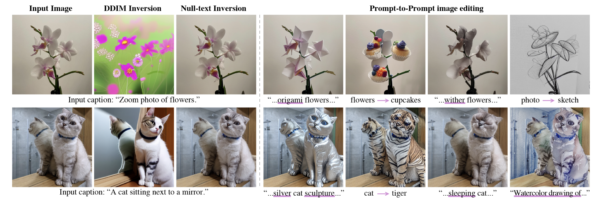
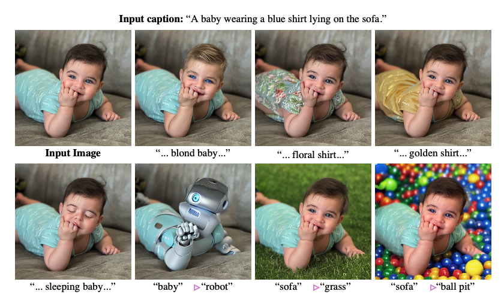
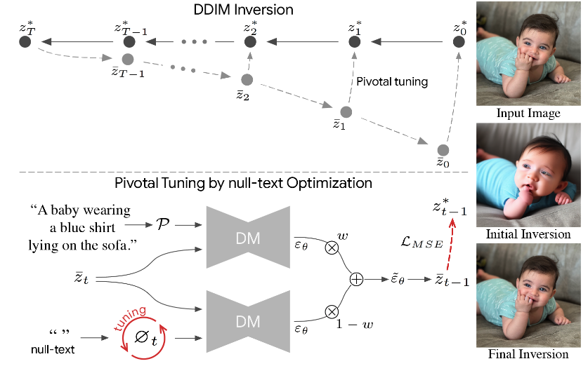
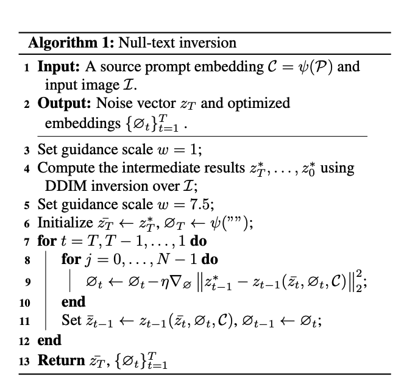
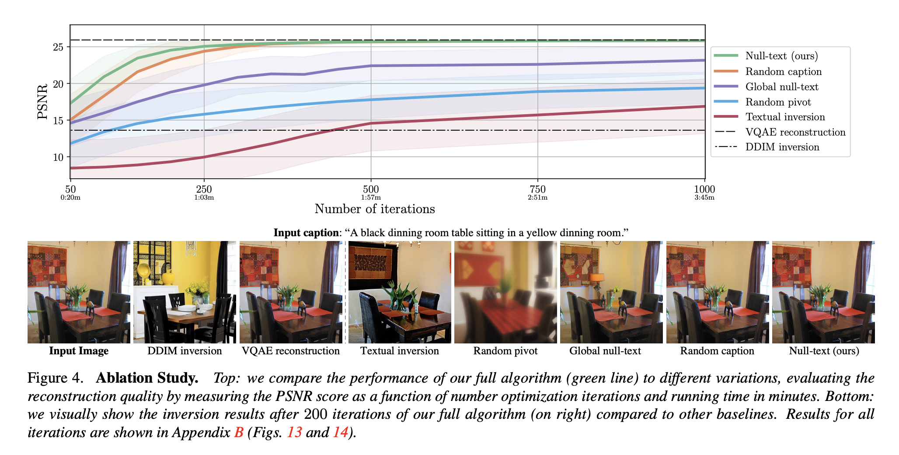
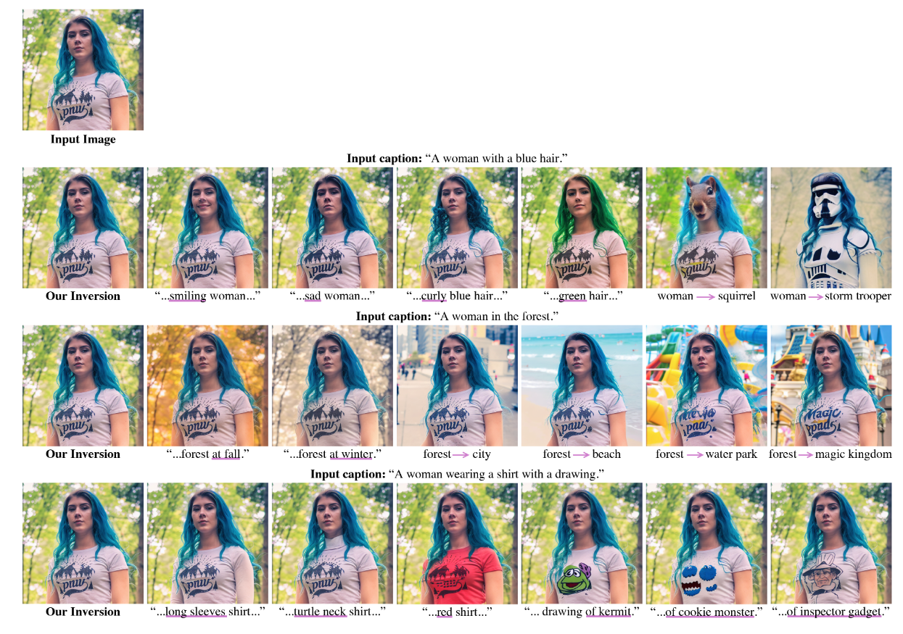
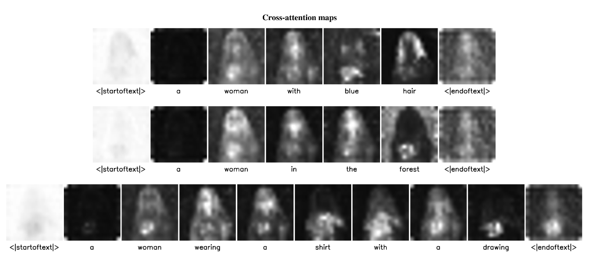
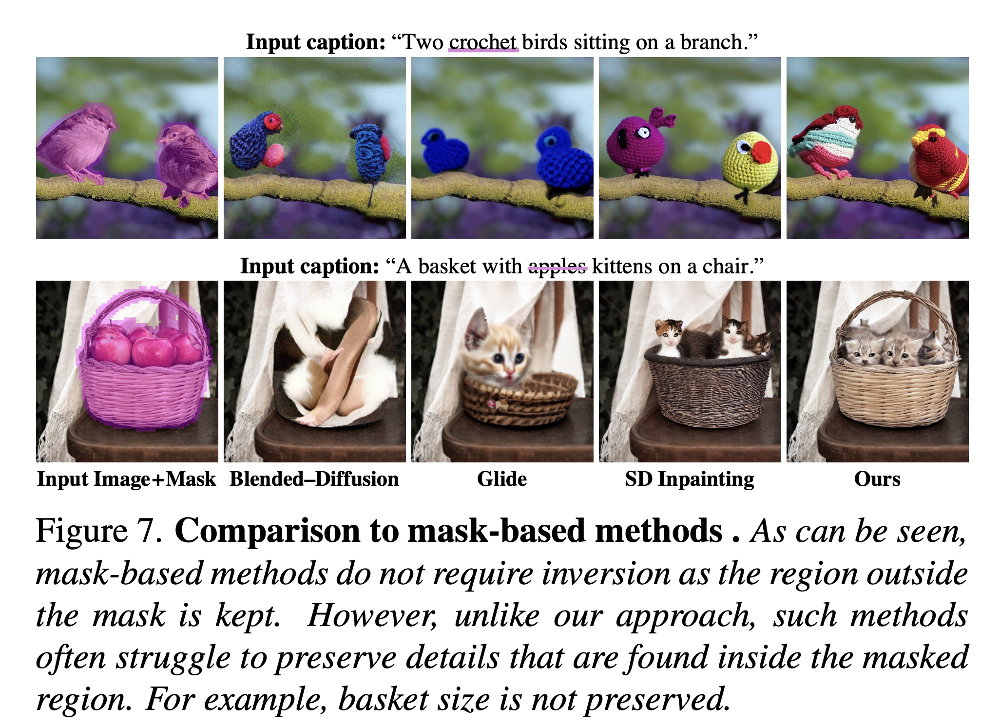
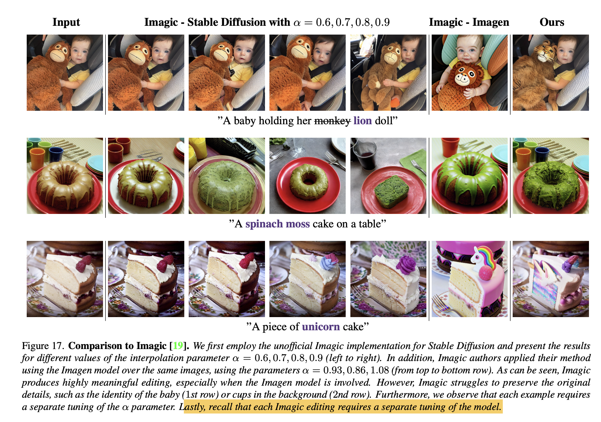

# Summary Notes (Null-Text Inversion)

Text-guided editing of a real image with the Stable Diffusion requires inverting the given image and textual prompt. That is, finding an initial noise vector that produces the input image when fed with the prompt into the diffusion process while preserving the editing capabilities of the model.

The paper introduces an accurate inversion scheme, achieving near-perfect reconstruction, while retaining the rich text-guided editing capabilities of the original model. The approach consists of two novel ideas:

1. **Pivotal inversion for diffusion models**: While current methods aim at mapping random noise samples to a single input image, the authors use a single pivotal noise vector for each timestamp and optimize around it. They demonstrate that a direct DDIM inversion is inadequate on its own, but does provide a rather good anchor for our optimization. 
   
2. **Null-text optimization**: They only modify the unconditional textual embedding that is used for classifier-free guidance, rather than the input text embedding. This allows for keeping both the model weights and the conditional embedding intact and hence enables applying prompt-based editing while avoiding the cumbersome tuning of the model's weights.

## Notations
- $\mathcal{I}$: input real image
- $\mathcal{I}^*$: edited image
- $\mathcal{P}$: input prompt
- $\mathcal{I}^*$: edited prompt
- $\epsilon_\theta$: trained noise prediction network
- $z_t$: random noise vector
- $z_0$: noise vector corresponding to an image
- $\mathcal{C} = \psi(\mathcal{P})$:  embedding of the text condition
- $\mathcal{\phi} = \psi("")$:  embedding of the null text

## Null-text inversion 

### Classifier-free guidance
Classifier-Free Guidance (CFG) is a lightweight technique to encourage prompt-adherence in text-to-image generation. In diffusion models, in each step, the prediction is performed twice: once unconditionally and once with the text condition. These predictions are then extrapolated to amplify the effect of the text guidance. The CFG prediction is defined as: $\bar{\epsilon_\theta}(z_t, t, \phi)= w\epsilon_\theta(z_t, t, C) + (1-w) \epsilon_\theta(z_t, t, \phi)$

### DDIM Inversion
DDIM inversion is a simple inversion technique that is reverse of DDIM sampling, based on the assumption that the ODE process can be reversed in the limit of small steps. The diffusion process in performed in the reverse direction, that is $z_0 \rightarrow z_T$ insted of $z_T \rightarrow z_0$

### Observations
The aprroach is based on the following observations:

1. First, DDIM Inversion consists of performing DDIM sampling in reverse order. In practice, a slight error is incorporated in every step. For unconditional diffusion models, the accumulated error is negligible and the DDIM inversion succeeds. However, recall that meaningful editing using the Stable Diffusion model requires applying classifier-free guidance with a large guidance scale w > 1. But the large guidance scale amplifies the accumulated error. Therefore, performing the DDIM inversion procedure with classifier-free guidance results not only in visual artifacts, but the obtained noise vector might be out of the Gaussian distribution. The latter decreases the editability.

**DDIM Observations table**
|   CFG Scale       | Inversion    | Inference | Observations |
| -------- | ------- |------- |------- |
| w | 1 | 1 | Inversion works, but not editable |
| w | >1 | >1 | Inversion fails |
| w | 1 | >1 | Inversion kind of ok, editable |

2. Second, optimizing the unconditional null embedding, which is used in classifier-freeguidance, allows an accurate reconstruction while avoiding the tuning of the model and the conditional embedding. Thereby preserving the desired editing capabilities. Therefore, the authors replace the default null-text
embedding with an optimized one, referred to as null-text optimization

### Pivotal Inversion
- Recent inversion works use random noise vectors for each iteration of their optimization, aiming at mapping every noise vector to a single image. Authors observe that this is inefficient as inference requires only a single noise vector.
- In particular, authors aim to perform our optimization around a pivotal noise vector which is a good approximation and thus allows a more efficient inversion.
- **For this, authors use DDIM inversion with guidance scale w = 1 as a rough approximation of the original image which is highly editable but far from accurate.**
- The DDIM inversion with $w=1$ is called as pivot trajectory and optimization is performed around it. The optimization aims to maximize the similarity to the original image.
$min||z_{t-1}^{*} - z_{t-1} ||_2^2$ 
- Note, a separate optimization is performed for each timestep $t$ from $t=T \rightarrow t=1$ with the endpoint of the previous step optimization as the starting point for the current $t$.

### Null-text optimization
- As mentioned before, authors optimize only the unconditional embedding $\phi$ as part of null-text optimization with the model and the conditional textual embedding as being kept unchanged.
- Authors observed that optimizing a different ”null embedding” for each timestamp $t$ significantly improves the reconstruction quality and is best suited for pivotal inversion.
- Therefore, the unconditional text embeddings ( $\phi_{t=1}^{T}$ ) at all steps is optimized with starting point as previous timestep result.
$min \vert \vert z_{t-1}^{*} - z_{t-1}(\bar{z_t, \phi_t, C}) \vert\vert_2^2$ 

The full algorithm can be summarized as follows:

## Inversion ablation study

