# Summary Notes (Prompt-to-prompt Image Editing)

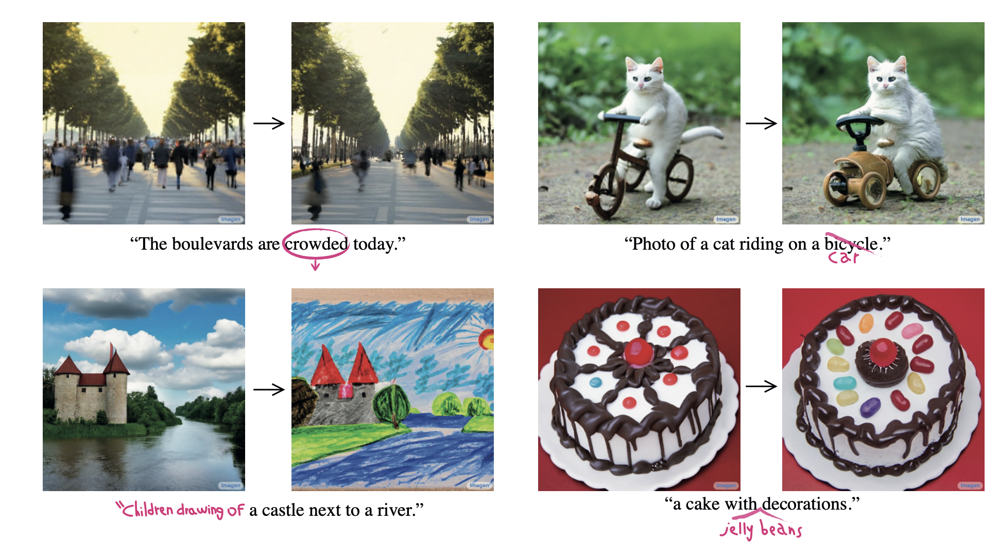

- In this paper, the authors introduce a textual editing method to semantically edit images in pre-trained text-conditioned diffusion models via Prompt-to-Prompt manipulations. The approach allows for editing the image while preserving the original composition of the image and addressing the content of the new prompt.  
- Authors consider the internal cross-attention maps, which are high-dimensional tensors that bind pixels and tokens extracted from the prompt text and explore their semantic strength as a handle to control the generated image
- The key idea is that onr can edit images by injecting the cross-attention maps during the diffusion process, controlling which pixels attend to which tokens of the prompt text during which diffusion steps. 
- The authors propose three methods to control the cross-attention maps through a simple and semantic interface. 

  - The first is to change a single token’s value in the prompt (e.g., “dog” to “cat”), while fixing the cross-attention maps, to preserve the scene composition. 

  - The second is to globally edit an image, e.g., change the style, by adding new words to the prompt and freezing the attention on previous tokens, while allowing new attention to flow to the new tokens.
  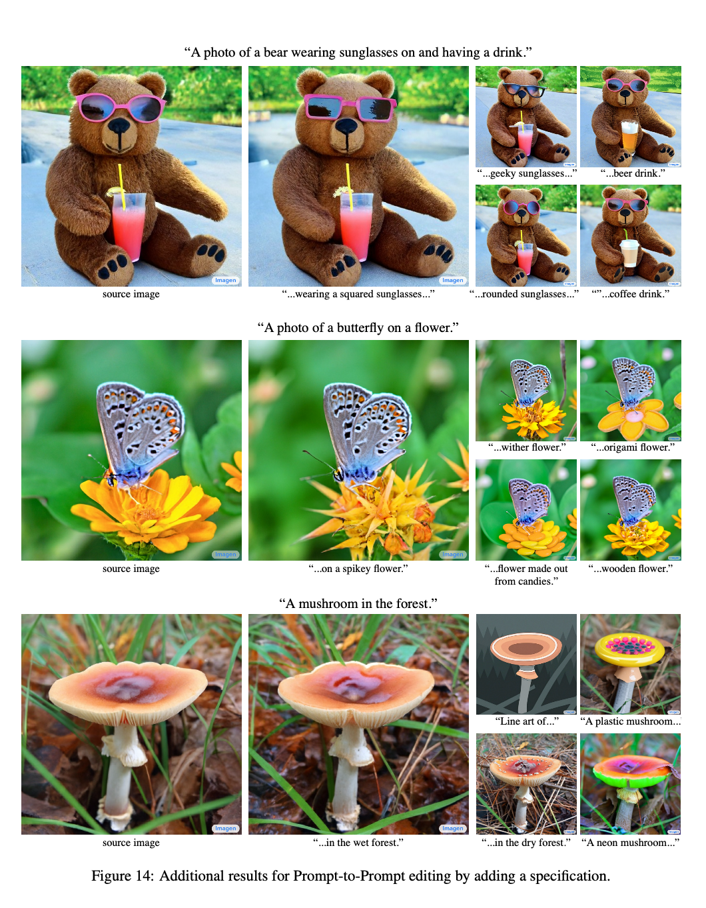

  - The third is to amplify or attenuate the semantic effect of a word in the generated image
  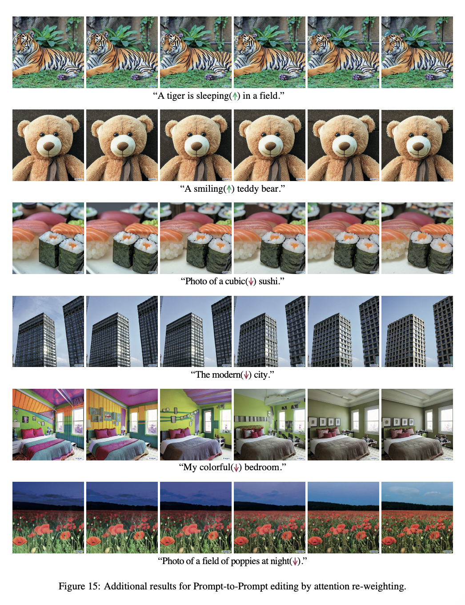

> Note, this method enables various editing tasks without the requirements like model training, fine-tuning, extra data, or optimization.

## Notations
- $\mathcal{I}$: input real image
- $\mathcal{I}^*$: edited image
- $\mathcal{P}$: input prompt
- $\mathcal{P}^*$: edited prompt
- $M_t$: input attention map
- $M_t^*$: produced attention map for edited prompt
- $\hat{M}$: final attention map by combining $M_t$ and $M_t^*$ to make the edit
- $DM(z_t, \mathcal{P},t,s)$: computation of a single step $t$ of the diffusion process
- $DM(z_t, \mathcal{P},t,s)\{M\leftarrow\hat{M}\}$: computation of a single step $t$ of the diffusion process
- $Edit(M_t, M_t^*, t)$: general edit function

> Note: authors only change or modify cross-attention maps. No changes are made to self-attention maps.
## Method
- One key observation is that the structure and appearances of the generated image depend not only on the random seed, but also on the interaction between the pixels to the text embedding through the diffusion process.
- By modifying the pixel-to-text interaction that occurs in cross-attention layers, one can do Prompt-to-Prompt image editing.
- More specifically, injecting the cross-attention maps of the input image ($\mathcal{I}$) enables to preserve the original composition and structure.

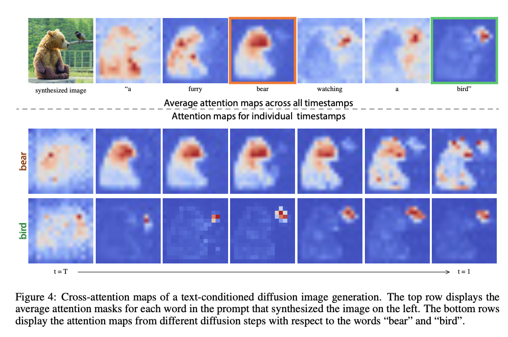

- **"Pixels are more attracted to the words that describe them"**

- Since the attention reflects the overall composition, one can inject the attention maps $\mathcal{M}$ that were obtained from the generation with the original prompt $\mathcal{P}$, into a second generation with the modified prompt $\mathcal{P^\*}$. This allows the synthesis of an edited image $\mathcal{{I}^\*}$ that is not only manipulated according to the edited prompt, but also preserves the structure of the input image $\mathcal{I}$. 

- A generic algorithm is given as follows:
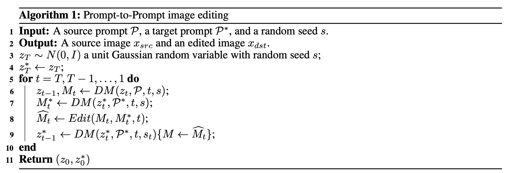

> Note,, authors use **Imagen** as the text-guided synthesis model as the pre-trained diffusion notework. However, the same approach should work for Stable diffusion and it's variants.

## Different type of edits
- Since, one can modify the attention in different ways, the authors propose three attention modification types:**
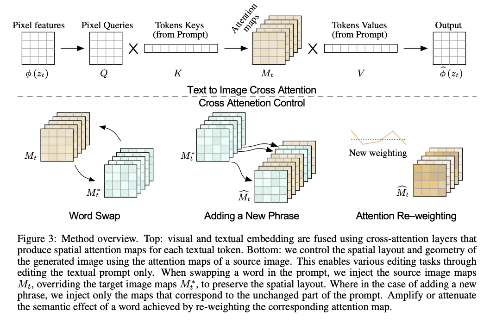

### **Word swap**
In this case, the user swaps tokens of the original prompt with others. For e.g., $P$=“a big red
bicycle” to $P^*$=“a big red car”.
    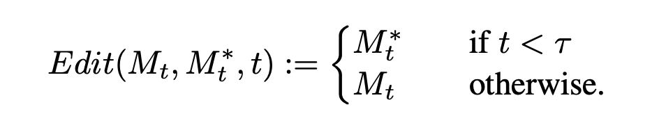
Here, $\tau$ is a timestamp parameter that determines until which step the injection is applied.

### **Adding a new phrase**
In another setting, the user adds new tokens to the prompt. For e.g., $P$=“a castle next to a river” to $P^∗$=“children drawing of a castle next to a river”.
    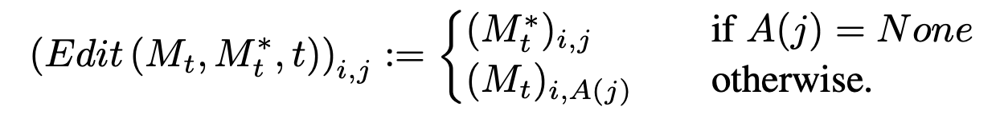
- $A$ is an alignment function that receives a token index from target prompt $P^*$ and outputs the corresponding token index in $P$ or None if there isn’t a match. $i$ corresponds to a pixel value, where $j$ corresponds to a text token.
- This kind of editing enables diverse Prompt-to-Prompt capabilities such as stylization, specification of object attributes, or global manipulations
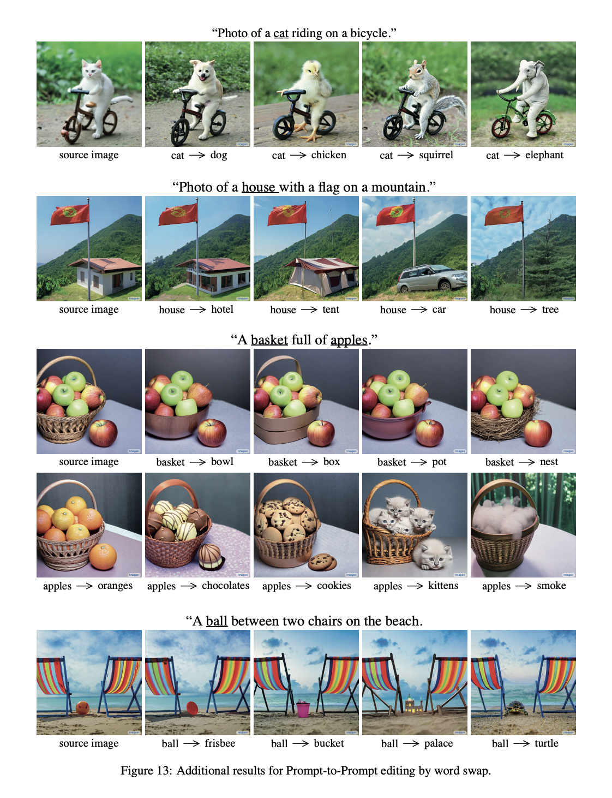

### **Attention re-weighting**
In last setting, the user may wish to strengthen or weakens the extent to which each token is affecting the resulting image. For example, consider the prompt $P$= “a fluffy red ball”, and assume one want to make the ball more or less fluffy.
    
- $c \in [-2,2]$ is the scaling factor for token $j^*$, resulting in stronger/weaker effect.

## Real-image editing
- For real-image editing, one needs the initial noise vector which can be calculated using DDIM-inversion. However, there might be some failure cases based on the inversion results.
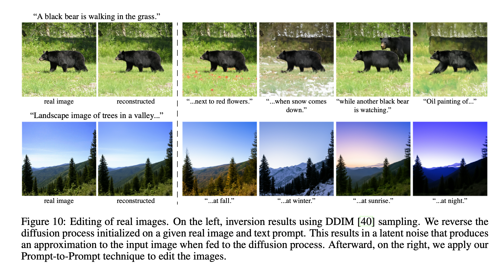

> Note: One can also generate the initial noise vector using better approaches such as null-text inversion. 

## Real-image editing
- For real-image editing, one needs the initial noise vector which can be calculated using DDIM-inversion. However, there might be some failure cases based on the inversion results.

## Mask-based editing
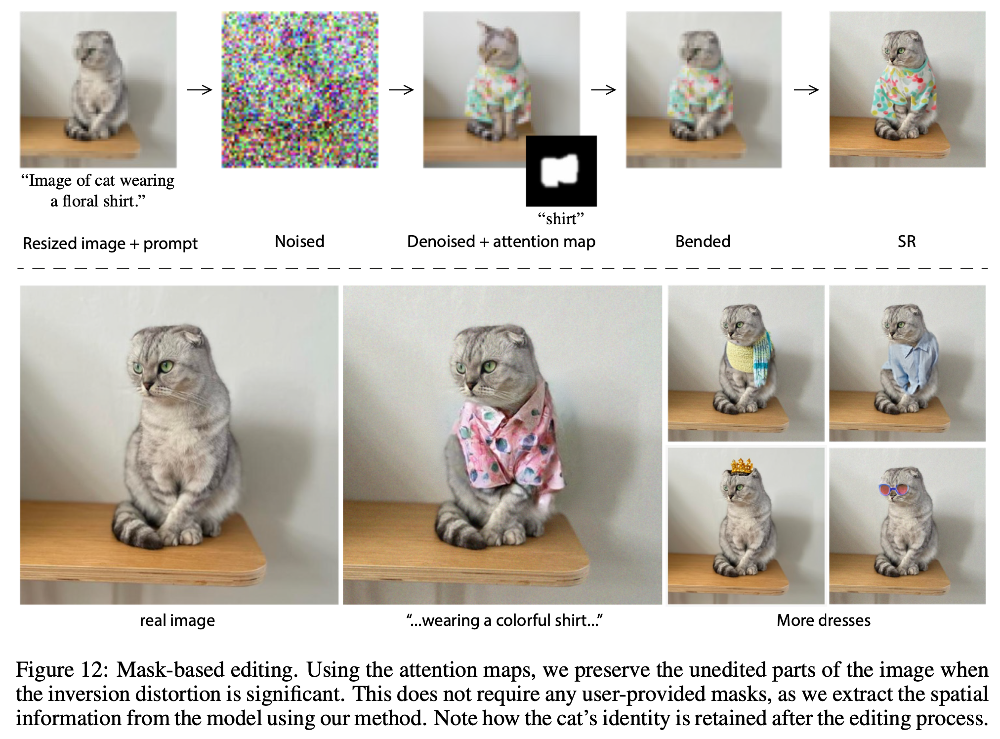
