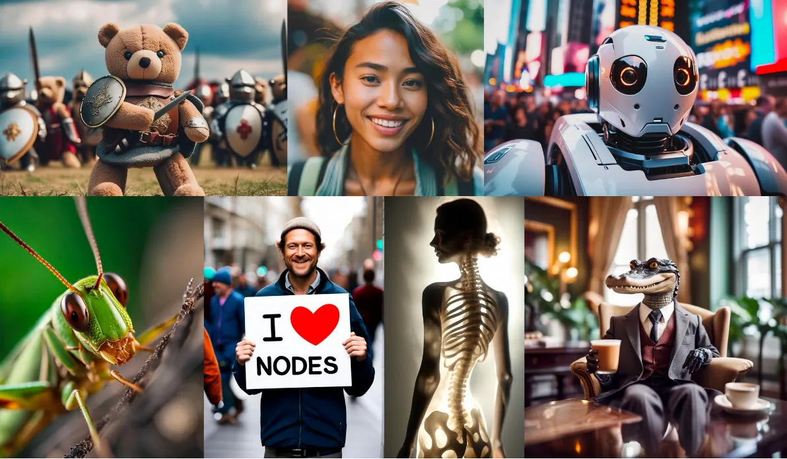
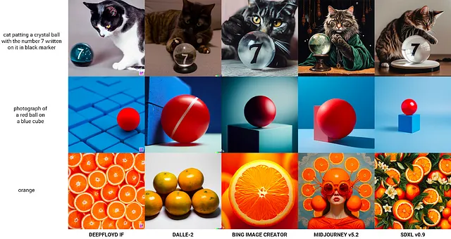
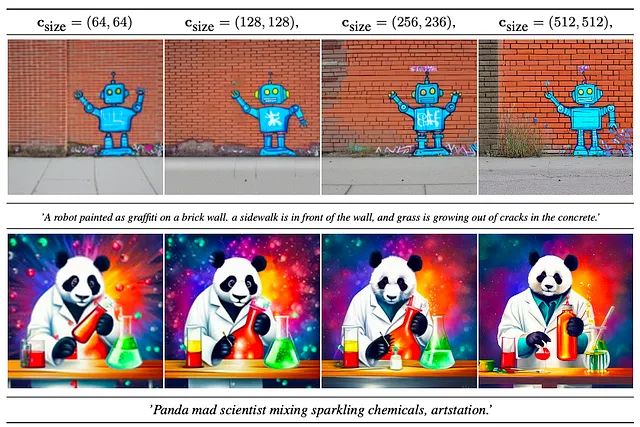
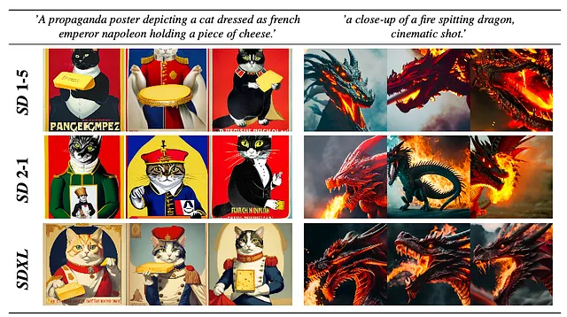
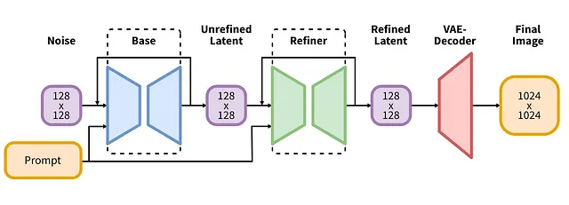
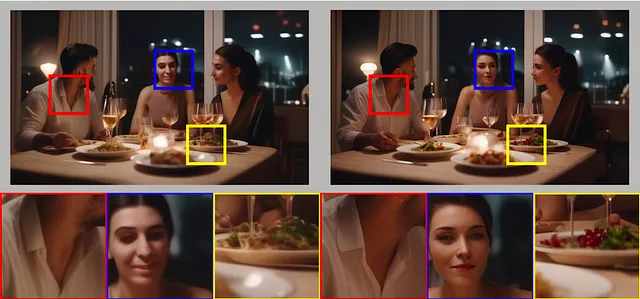

# Summary Notes (SDXL)

- Stable Diffusion XL (SDXL) is a new text-to-image vastly improved generative model developed by Stability AI. Following the successful release of the SDXL beta version in April, Stability AI recently unveiled SDXL 0.9. Like all their foundational models, it is an open-source release that includes all the code and model weights.

- SDXL is a vastly improved version of Stable Diffusion. It is capable of generating images with far more realistic aesthetics, photo-realism, and facial feature generation. The generated images are comparable to those from state-of-the-art black box approaches like Midjourney 5.1/5.2.

- Like its predecessors SD1.5 and SD2.1, SDXL is a latent diffusion model. However, the team at Stability AI has implemented a number of significant improvements. These include enhancements to the UNet architecture, the introduction of multiple text encoders, new conditioning schemes, multi-aspect training, and a novel refinement model.

## U-Net architecture
- Firstly, SDXL uses a much larger UNet backbone. As a result, the UNet has almost 3X model parameters (~2.6B) in comparison to earlier versions (~860M). Secondly, they shift the bulk of the transformer computation to lower-level features in the UNet. 
- Specifically, they use a heterogeneous distribution of transformer blocks. And for efficiency, they omit the transformer block at the highest feature level, use 2 and 10 blocks at lower levels, and remove the lowest level (8×downsampling) in the UNet altogether.

## Multiple text encoders
- SDXL employs a combination of two text encoders for text (prompt) conditioning. 
- It integrates the powerful [OpenCLIP ViT-bigG](https://zenodo.org/record/5143773) and [CLIP ViT-L](https://arxiv.org/abs/2103.00020) by concatenating the penultimate text encoder outputs along the channel axis. Furthermore, it conditions the model using the pooled text embedding from the OpenCLIP model.

## Different Conditioning Schemes
### Conditioning the model on Image Size
- The Latent Diffusion Model (LDM) requires a minimum image size for training. Traditional techniques, such as discarding smaller images or upscaling them, can lead to data loss, impacting performance and generalization, or introduce upscaling artifacts, affecting the quality of the model's outputs.
- SDXL offers an alternative solution to this image size issue in training the UNet model. It conditions the model on the original image resolution by providing the original height and width of the images as additional parameters. 
- Each parameter is independently embedded using Fourier feature encoding and added to the model timestep embedding. This also allows users to set their desired resolution during the inference stage.

> Note, the effects of size conditioning are not clearly visible in the final SDXL model due to the multi-aspect (ratio) fine-tuning that we will discuss later.

### Conditioning the model on image crops
- One of the shortcomings of previous Stable Diffusion (SD) models was the generation of images with cropped objects at times. This issue likely was the result of random cropping during training.
- In contrast, SDXL addresses this concern by introducing a novel conditioning method. During data loading, crop coordinates are uniformly sampled and used as conditioning parameters, similar to image size conditioning. 
- This method, combined with size conditioning, allows for more control over the image synthesis process and helps ensure that cropping-induced data augmentation does not negatively impact the generation process.
- Furthermore, it allows to simulate cropping during inference by adjusting the crop coordinates, resulting in object-centered generation.

## Multi-aspect Training
- Commonly, text-to-image generative models use square images (512x512 or 1024x1024 pixels) as training examples, even though real-world datasets contain images with diverse sizes and aspect ratios.
- To address this limitation, SDXL incorporates multi-aspect training as a fine-tuning stage. This approach enables the model to handle images of multiple aspect ratios simultaneously. 
- The dataset is partitioned into buckets, ensuring similar pixel counts close to 1024² while allowing for variations in height and width. During training, batches consist of images from the same bucket, with bucket selection alternating for each training step. 
- Additionally, the model receives the target size as conditioning, similar to the conditioning techniques discussed earlier. Note, the multi-aspect training is done using an offset-noise.

> For more details on multi-aspect training and data bucketing, please refer to [Noval AI's SD improvements blog](https://blog.novelai.net/novelai-improvements-on-stable-diffusion-e10d38db82ac)

## Improved Autoencoder
SDXL utilizes an autoencoder with an identical architecture to the one used in the original SD. However, the autoencoder is retrained using a larger batch size and employs exponential moving average (EMA) weight tracking. This enhanced autoencoder excels in recovering high-frequency details in generated images.

## Image-to-image refinement model

- SDXL flowchart containing both base and refinement models (Taken from SDXL report)The base SDXL model may occasionally produce samples with low local quality, meaning it may miss finer local features. 
- To improve the sample quality, a separate image-to-image latent diffusion model is trained in the same latent space. This specialized model focuses on high-quality, high-resolution data and utilizes a noising-denoising process inspired by SDEdit.
- During inference, the latent vectors generated by the base SDXL model undergo diffusion and denoising using the refinement model while keeping the same text input. It is important to note that the refinement step is optional, but it consistently yields better overall results.

## References
- SDXL technical report: https://github.com/Stability-AI/generative-models/blob/main/assets/sdxl_report.pdf
- Offset noise in Stable diffusion: https://www.crosslabs.org/blog/diffusion-with-offset-noise
- Noval AI's blog on Stable Diffusion improvements: https://blog.novelai.net/novelai-improvements-on-stable-diffusion-e10d38db82ac
- SDEdit: https://arxiv.org/abs/2108.01073
- CLIP-VIT-L: https://arxiv.org/abs/2103.00020
- OpenCLIP Vit-bigG: https://zenodo.org/record/5143773