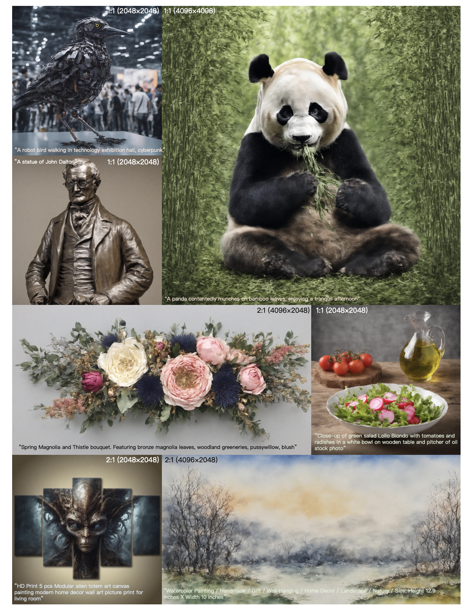
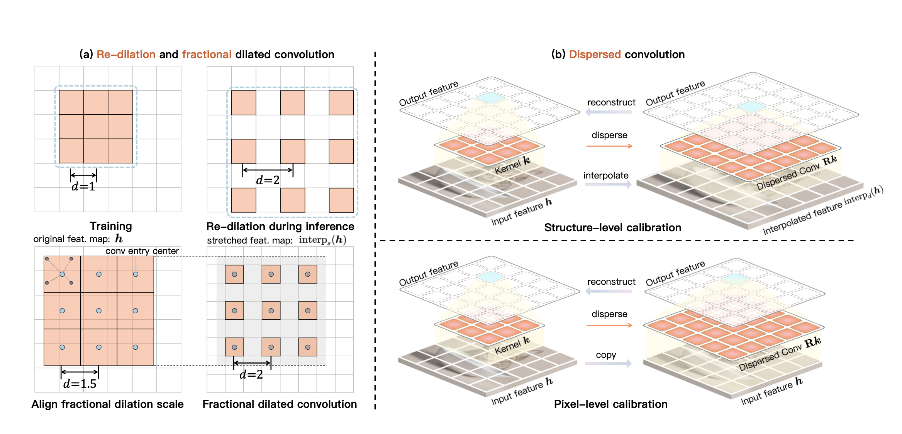

# Summary Notes (ScaleCrafter)

## Gist of the paper
- Stable Diffusion (SD) models, which are based on LDMs, have been open-sourced and are known for their high-quality outputs and creative potential.

- Despite their capabilities, these models are typically constrained by the resolution they were trained on, such as 512² for SD 2.1 and 1024² for SD XL, highlighting the need for methods that can generate images at higher resolutions like 2K and 4K.

- Sampling images at resolutions higher than what the models were trained on (512 × 512) or (1024 X 1024) leads to significant issues, such as object repetition and structural anomalies.

- The paper addresses the challenge of generating high-resolution images for applications such as advertising, where the demand exceeds the `1024 × 1024` resolution limit of popular text-to-image models like Stable Diffusion, SD-XL, Midjourney, and IF.

- The paper introduces a dynamic re-dilation strategy that doesn't require additional tuning and is effective in addressing the repetition problem.

- For even higher resolutions (e.g., 16 times the training resolution), they propose novel techniques like dispersed convolution and noise-damped classifier-free guidance to maintain quality and denoising capabilities.

## Related work
- Previous approaches are generally categorized into two methods: training new models from scratch or fine-tuning existing models.

- Jin et al. (2023) explored a training-free method for adapting to different image sizes, but this method falls short for higher-resolution image generation.

- Multi-Diffusion and SyncDiffusion techniques aim to smooth out inconsistencies in overlapping regions of images, yet they do not fully overcome the problem of object repetition.

- MultiDiffusion offers a partial solution to repetition by incorporating user inputs regarding region and text, but this is not applicable in text-to-image generation where such inputs are not used.

## Motivation and Improvements

- Upon examining the generation process and the structure of the Stable Diffusion model, the authors find the following:
  - The problem may lie in the network components' receptive fields not being suitable for larger resolutions.
  - Changing standard convolution to dilated convolution improves overall structure and reduces repetition, though some issues remain at local edges.

- Based on this examinations, they propose the following:
  - re-dilation to dynamically increase the receptive field during inference, along with dispersed convolution and noise-damped classifier-free guidance for ultra-high-resolution image generation.
  
- Moreover, this approach is effective across various diffusion models and a text-to-video model, with different resolutions and aspect ratios.

### 1. Re-Dilation
- Dilated convolution is defined mathematically and is used to expand the receptive field of the convolution operation.
- Unlike traditional dilated convolutions that maintain a constant dilation factor during both training and inference, the paper's approach, termed "re-dilation," dynamically adjusts the dilation factor during inference only.

$$f^d_k(h) = h \otimes \Phi_d(k), \quad (h \otimes \Phi_d(k))(o) = \sum_{s+d\cdot t=p} h(p) \cdot k(q) $$

- Moreover, to address the limitation of traditional dilated convolution, which cannot handle fractional multiples of the perception field (e.g., 1.5×), the authors propose a fractional dilated convolution.
- This method involves rounding up the target scale to an integer and stretching the input feature map accordingly, using an interpolation function like bilinear interpolation.

  $$ f^d_k(h) = \text{interp}_{1/s} (\text{interp}_s(h) \otimes \Phi_{d}(k)), \quad s = \lceil d \rceil / d, $$

> - $ f^d_k(h) $: The output feature map after applying dilated convolution.
> - $ h $: The input feature map.
> - $ k $: The convolution kernel.
> - $ \Phi_d(\cdot) $: The dilation operation with dilation factor $ d $.
> - $ \otimes $: The convolution operation.
> - $ o $: A specific location in the output feature map.
> - $ p, q $: Spatial locations used to index the feature map and kernel, respectively.
> - $ s $: The scale used for resizing the feature map in the re-dilation process.
> - $ interp_{\cdot}(\cdot) $: A resizing interpolation function (e.g., bilinear interpolation).
> - $ \lceil \cdot \rceil $: The ceiling function which rounds up to the nearest integer.

- The re-dilation factor is made layer-and-timestep-aware, meaning it can vary depending on the specific layer and timestep in the diffusion model's process.

- Empirical findings suggest that better synthesis quality is achieved when the dilation radius is progressively decreased from deeper to shallower layers and from noisier to less noisy steps, rather than using a fixed dilation factor throughout.

### 2. Convolution Dispersion
- Re-dilated convolution, while useful for increasing the receptive field in high-resolution image generation, can lead to periodic downsampling issues, such as grid-like artifacts.
- To overcome this, the authors propose a method to disperse the convolution kernel of a pre-trained layer
- This dispersion method involves using a linear transform to expand the size of the kernel, aiming to maintain the layer's original capabilities while enlarging its receptive field.
- Structure-level calibration is used to ensure that the performance of the pre-trained convolution layer is preserved when the size of the input feature map is changed. This calibration requires that the output of the convoluted interpolated feature map remains the same as if the original output was interpolated.

$$ \text{interpd}(f_k(\mathbf{h})) = f_{k'}(\text{interpd}(\mathbf{h})), \quad k' = Rk  $$

- Since the equation for structure-level calibration is underdetermined (the enlarged kernel has more elements than the original), pixel-level calibration is introduced to make the new, larger convolution kernel behave similarly on the original feature map.

$$\underset{R}{\text{min}} \left\| \text{interpd}(f_k(\mathbf{h})) - f_{k'}(\text{interpd}(\mathbf{h})) \right\|^2_2 + \eta \cdot \left\| f_k(\mathbf{h}) - f_{k'}(\mathbf{h}) \right\|^2_2 $$

> - $ k $: The original convolution kernel.
> - $ k' $: The dispersed convolution kernel after applying the transformation.
> - $ R $: The linear transform applied to obtain the dispersed kernel from the original kernel.
> - $ \eta $: A weight controlling the balance in the least square problem between the structure-level and pixel-level calibration.
> - $ \|\cdot\|_2 $: The L2 norm, which in this context measures the difference between the original and calibrated convolution outputs.

- Authors formulate a linear least squares problem to find the optimal transformation that minimizes the difference between the outputs of the original and dispersed kernels, both on the original and interpolated feature maps.

- The weight $\eta$ in the equation balances the focus of the dispersed convolution between the two types of calibration.
- By solving this problem, they derive an enlarged kernel that can be applied to any convolution kernel to increase its size without being tied to the specific numerical values of the input features or kernel.
- For fractional perception field scales, the dilation operation is replaced with convolution dispersion within the fractional dilated convolution framework.

### 3. Noise-damped Classifier Free-Guidance

- To generate images at higher resolutions, specifically four times the original height and width, the perception field in the denoising U-Net's outer blocks must be increased. 
- This is necessary to correctly render small object structures. However, expanding the perceptual field of convolution in these blocks can reduce the model's denoising ability, posing a challenge in preserving the denoising quality while generating accurate small structures.

- The proposed solution is noise-damped classifier-free guidance, which utilizes two model priors:

  1. A model with strong denoising capabilities, denoted as $\epsilon_{\theta}(\cdot)$.
  2. A model employing re-dilated or dispersed convolution for improved image content structure, denoted as $\tilde{\epsilon}_{\theta}(\cdot)$.

- The sampling process merges the predictions from both models using a guidance scale $w$, formulated as:

$$
\epsilon_{\theta}(x_t) + w \cdot (\tilde{\epsilon}_{\theta}(x_t, y) - \tilde{\epsilon}_{\theta}(x_t)),
$$

where $x_t$ represents the input at timestep $t$, and $y$ is the input text prompt. The base prediction $\epsilon_{\theta}(x_t)$ ensures effective denoising during sampling. The guidance term $(\tilde{\epsilon}_{\theta}(x_t,y) - \tilde{\epsilon}_{\theta}(x_t))$ contains two similar poor noise predictions that, when subtracted, cancel out the erroneous noise, leaving information that contributes to generating correct object structures.

- Experiments demonstrate that this method effectively mitigates incorrect noise predictions and supports the generation of accurate object structures in high-resolution image synthesis.

## Experiments and Examples

- On the project page, video generation examples are present
- They also make a comparison with SD-SR too. The result are comparable SD-SR having better FID and KID values.
- Note, the hyperparameters in the appendix for different resolution generation for different sizes is quite important
