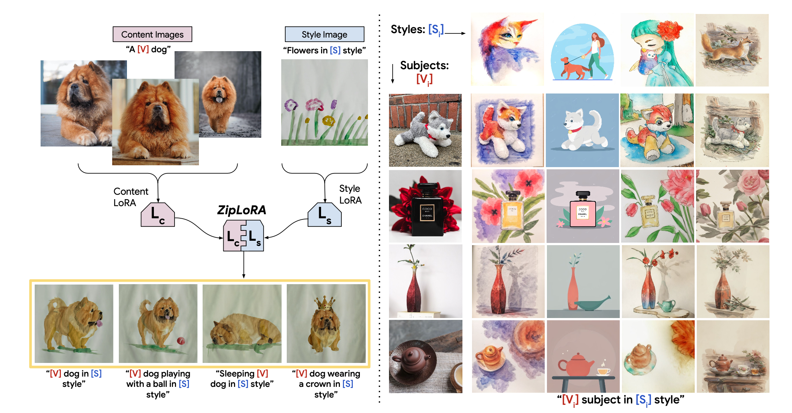
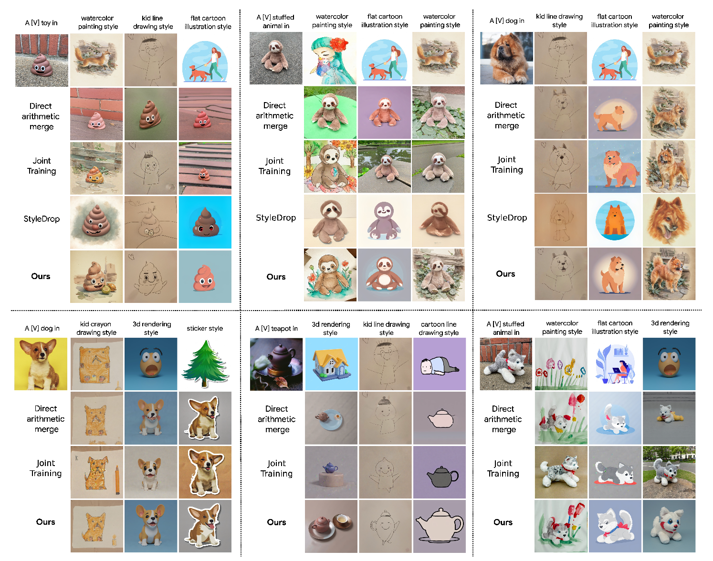
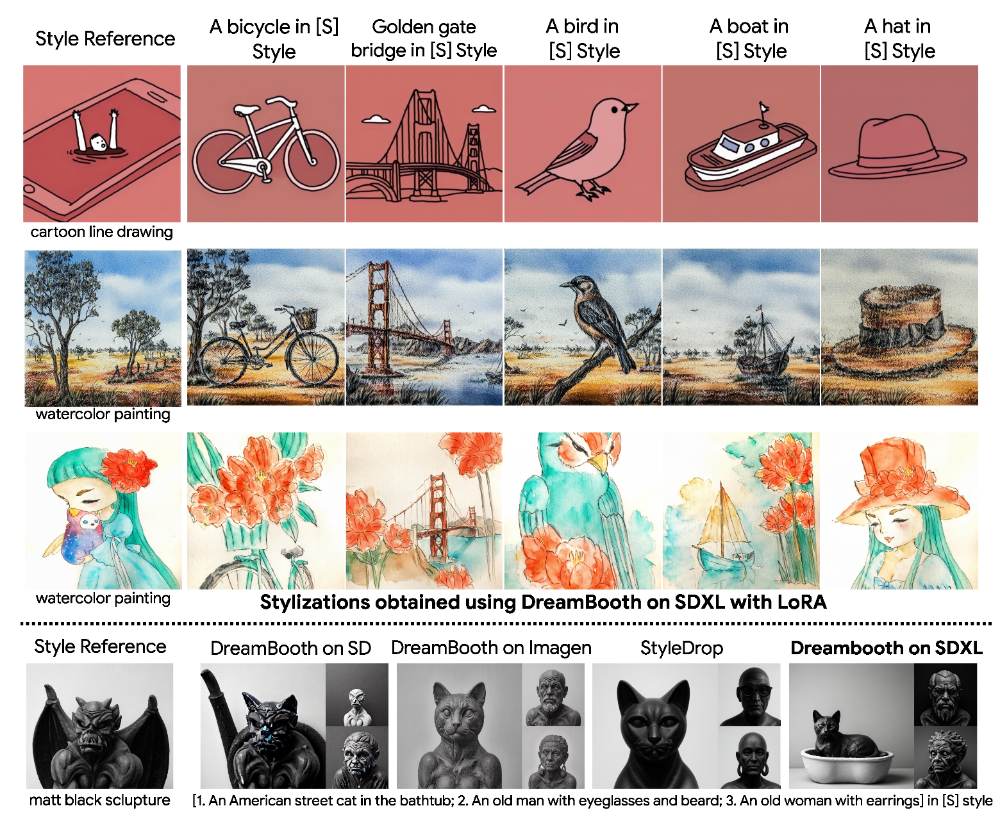
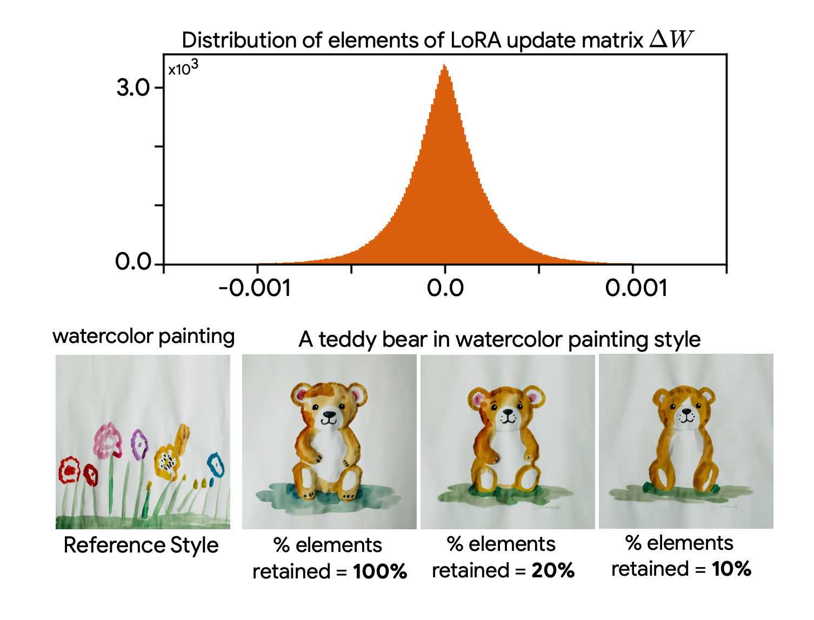
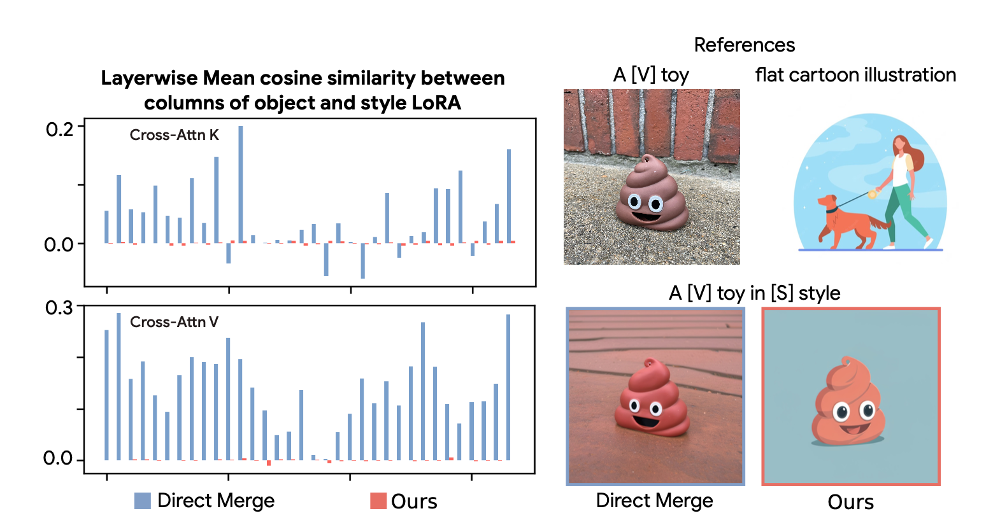
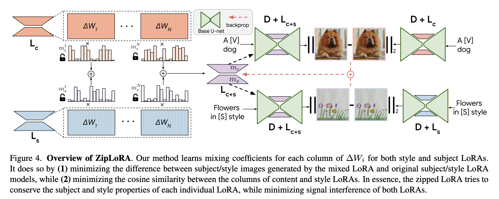
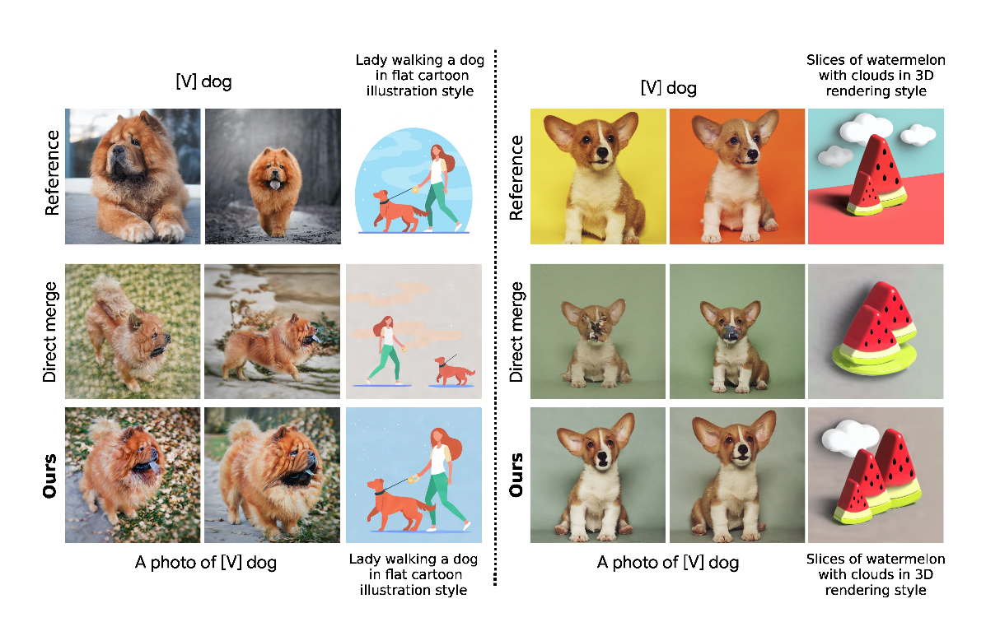
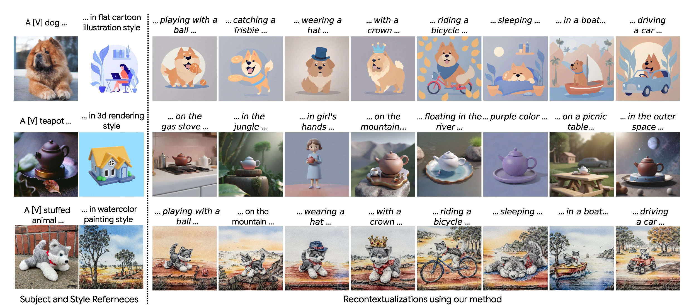

# Summary Notes (Zip Lora)

_**"ZipLoRA effectively merges independently trained style and content LoRAs and is able to generate any user-provided subject in any user-provided style, providing unprecedented control over personalized creations using diffusion models"**_




## Issue combining concept and style personalization
- Diffusion models can generate impressive images with their excellent understanding of diverse artistic concepts and enhanced controllability given a conditioning support.

- **Dreambooth** and **StyleDrop** approaches further helps in finetuning these diffusion models for concept and style personalization. This coupled with popular PEFT approach like, Low-rank adaption (LORA) allow personalization with much lower memory and storage.

- _A key persistent **unsolved problem** is to generate a specific user-provided subject in a specific user-provided style._

- For example, there have been attempts to merge LoRA weights, specifically by performing a linear combination of subject and style LoRAs, with variable coefficients. This allows for a control over the “strength” of each LoRA, and users sometimes are able, through careful grid search and sub- jective human evaluation, to find a combination that allows for accurate portrayal of the subject under the specific style. 

- However, such arithmetic summation method lacks robustness across style and subject combinations, and is also incredibly time consuming.



```
 - Joint training of subject and style is done using a multi-subject variant of Dream-Booth with multiple rare unique identifiers and is least flexible. 
 - It does not allow the use of pre-trained LoRAs, neither can it be used as a style-only or content- only LoRA.
```

## What is ZipLoRA? 

- **ZipLoRA**, a is simple optimization method that allows for effective merging of in- dependently trained style and subject LoRAs to allow for the generation of any subject in any style. It is a hyperparameter-free, i.e. it does not require manual tuning of any hyperparameters or merger weights.

- The approach is based on three important insights. 
  1) **SDXL exhibits strong style learning properties**:
     1) It is able to learn styles using just a single exemplar image by following a DreamBooth protocolwithout any human feedback. 
     2) This is unlike StyleDrop + Muse that is sub-optimal and requires human feedback.
  
  
  
  2) **LoRA update matrices are sparse**: 
     1) the update matrices $\Delta W$ for different LoRA layers are sparse, i.e., most of the elements in $\Delta W$ have a magnitude very close to zero, and thus have little impact on the output of the fine-tuned model. 
     2) This observation follows from the fact that the rank of $\Delta W$ is very small by design, thus the information contained in most columns of ∆W is redundant.
    
  
    
  3)  **Highly aligned LoRA weights merge poorly**:
      1) Columns of the weight matrices of two independently trained LoRAs may contain information that is not disentangled, i.e., the cosine similarity between them can be non-zero. 
      2) The extent of alignment between the columns of LoRA weights plays a significant role in determining the quality of resulting merge: if we directly add the columns with non-zero cosine similarity to each other, it leads to superimposition of their information about the individual concepts, resulting in the loss of the ability of the merged model to synthesize input concepts accurately. 
      3) Moreover, such loss of information is avoided when the columns are orthogonal to each other with cosine similarity equal to zero.
      4) It is intuitive that the merger would retain the information available in these columns only when the columns that are being added are or- thogonal to each other.
  
  
    
## ZipLoRA methodology

- The key concept of LoRA is the weight updates to the base model attention weights $W_0 \in \mathbb{R}^{d \times d} $ during fine-tuning is done as follows:

  $$ \Delta W = BA $$

  Here, $ \Delta W $ is the update to the base model weights $ W_0 $, which can be decomposed into two low-rank matrices $ B $ and $ A $. Here, $ B \in \mathbb{R}^{d \times r} $ and $ A \in \mathbb{R}^{r \times k} $, with $ r \ll \min(d, k) $ being a small rank. 

- Thus, the updated weight matrix $W$ is then:

  $$ W = W_0 + BA $$

  where $ W_0 $ is the pre-trained base model weight matrix of the Diffusion model ($D$).

- Adaptation of the base model $D$  to any given concept involves adding the corresponding set of LoRA weights $ \Delta W $ to the model weights. This is represented as:

  $$ D_{L} = D \oplus L = W_0 + \Delta W $$

- For the givem two independently trained set of LoRAs, concept: $L_c = { \Delta W_c }$ and style: $L_s = { \Delta W_s }$, we aim to find the merged $L_m = Merge(L_c, L_s)$ Lora that can combine the effects of both the individual LoRAs in order to stylize the given object in a desired reference style.

  
- One popular and simplest way to do this is the direct merge which is the linear combination of individual LoRAs:
  $$ \Delta W_m = w_c \cdot \Delta W_c + w_s \cdot \Delta W_s $$

  Here, \( \Delta W_m \) is the merged weight update, $ w_c $ and $w_s$ are the coefficients for content and style LoRAs respectively


- To prevent signal interference during the merger like in direct merge approach, ZipLoRA introduces a set of merger coefficient vectors $ m_c \) and \( m_s \) for each LoRA layer of the content and style LoRAs respectively. These are learnable coefficient such that the orthogonality between the columns can be achieved.
  
  $$ L_m  = Merge(L_c, L_s, m_c, m_s) $$
  
  $$ \Delta W_m = m_c \otimes \Delta W_c + m_s \otimes \Delta W_s $$
   
   

- The ZipLoRA approach has two goals: 
  1) to minimize the interference between content and style LoRAs, defined by the cosine similarity between the columns of content and style LoRAs
  2) Conserving the capability of the merged LoRA to generate the reference subject and style independently by minimizing the difference between subject/style images generated by the mixed LoRA and original subject/style LoRAs. Therefore, ZipLoRA optimization problem is framed with the following loss function:

  $$ L_{merge} = \|(D \oplus L_m)(x_c, p_c) - (D \oplus L_c)(x_c, p_c)\|^2 $$
  
  $$ + \|(D \oplus L_m)(x_s, p_s) - (D \oplus L_s)(x_s, p_s)\|^2 $$
  
  $$+ \lambda \sum_i |m(ci) \cdot m(si)| $$
   
  Here, $ p_c $ and $ p_s $ are text conditioning prompts for content and style; $ \lambda $ is a multiplier for the cosine-similarity loss term.

- Note,the weights of the base model and the individual LoRAs frozen, and updates are only made for the merger coefficient vectors.




## Experimental Setup
- Dataset: content images from Dreabooth dataset (4-5 images for each concept) and style images from StyleDrop dataset (1 image per style)
-  DreamBooth fine-tuning with LoRA of rank 64 for obtaining all the style and content LoRAs. 
-  Adam optimizer: 1000 steps, batch size of 1 and learning rate of 0.00005. 
-  Text encoders of SDXL frozen during the LoRA fine-tuning. 
-  For ZipLoRA, $\lambda = 0.01$ 
-  Optimization until cosine similarity drops to zero with a maximum number of gradient updates set to **100**.


## Ablation studies
- Note, ZipLoRA does not lose the ability to generate individ- ual concepts, unlike the direct merge approach.


- The method can re-contextualizes the reference subject while preserving the stylization in the given style.


- Crude metric for different alignments
  - **Style-alignment**:  CLIP-I scores of image embeddings of output and the style reference 
  - **Subject-alignment**: DINO features for the output and the reference subject
  - **Text-alignment**: CLIP-T embeddings of the output and the text prompt
  
    - In all three cases, cosine-similarity is used as the metric and average is taken over different subjects in different styles each.
    - Note, these are crude metrics and are entangled with semantic properties of images, such as the overall content.