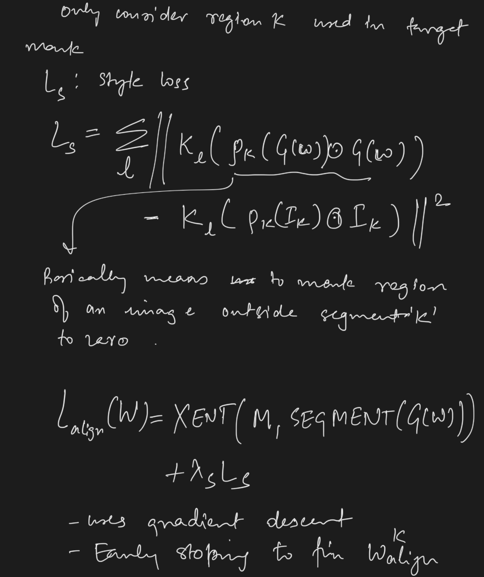

# Barbershop: GAN-based Image Compositing using Segmentation Masks

## Summary
- Seamlessly blending features from multiple images is extremely challenging because of complex relationships in lighting, geometry, and partial occlusion which cause coupling between different parts of the image

- A novel solution to image blending, particularly for the problem of hairstyle transfer, based on GAN-inversion
  - They discuss a latent space for image blending which is better at preserving detail and encoding spatial information
  - A new GAN-embedding algorithm which is able to slightly modify images to conform to a common segmentation mask
  - They are able to transfer the visual properties from multiple reference images including specific details such as moles and wrinkle
  - They do image blending in a latent-space, therefore are able to synthesize images that are coherent

- Note, the source code available at [Barbershop Github](https://zpdesu.github.io/Barbershop)

## Issues with hair transfer and face-swapping
- The composite image editing that involves the problems of hair- transfer and face-swapping are extremely difficult due to
  - the visual properties of different parts of an image are not independent of eachother
  - For example, the visual qualities of hair are heavily influenced by ambient and reflected light as well as transmitted colors from the underlying face, clothing, and background
  - The pose of a head influences the appearance of the nose, eyes and mouth
  - the geometry of a person’s head and shoulders influences shadows and the geometry of their hair
  - The shape of the hair is influenced by pose and also by the camera intrinsic parameters, and so the pose might have to change to adapt to the hair
  -  The disocclusion of the background which happens when the hair region shrinks with respect to the background. 
  -  Disocclusion of the face region can expose new parts of the face, such as ears, forehead, or the jawline

## Semantic Alignment
- A key insight they present is that mixing images that are each of high quality, but also where each pixel has the same semantic meaning, produces new images with fewer undesirable artifacts
  - One particular benefit of semantic alignment is that regions of the image which are disoccluded are filled with semantically correct image contents
  - Thy introduce a GAN-based semantic alignment step which generates high quality images similar to the input images, but which have a common semantic segmentation
  - When the semantic regions relevant to the task (e.g. hair) are aligned, artifacts caused by transparency, reflection, or interaction of the hair with the face, are less noticeable

## Previous work on hair transfer based on GANs
-  Based on conditional GAN generators in which each condition module is specialized to represent, process, and convert reference inputs with different visual attributes [Tan et al. 2020],
-  Based on latent space optimization with carefully designed loss and gradient orthogonalization to explicitly disentangle hair attributes [Saha et al. 2021]. 
- Issues:
  - Both of these approaches need pretrained inpainting networks to fill holes left over by misaligned hair masks, which may lead to blurry artifacts and unnatural boundaries.
  - They also dont make use of a semantic alignment step to merge semantic regions from different reference images in latent space, e.g. to align a hair region and a face region from different images

## Related work

### GAN-based Image Generation
- GANs such as ProGAN [Karras et al. 2017], StyleGAN [Karras et al. 2018], and StyleGAN2 [Karras et al. 2020b] show the ability of GANs to produce very highly detailed and high fidelity images that are almost indistinguishable from real images.
- StyleGAN-ada [Karras et al. 2020a] showed that a GAN can be trained on limited data without compromising the generative ability of a GAN. 
- High quality image generation is also attributed to the availability of high quality datasets like FFHQ [Karras et al. 2018], AFHQ [Choi et al. 2020] and LSUN objects [Yu et al. 2015]. 
- On the other hand, BigGAN [Brock et al. 2018] can produce high quality samples using complex datasets like ImageNet [Deng et al. 2009]. 
- Some other notable methods for generative modeling include Variational Autoencoders (VAEs) [Kingma and Welling 2013], PixelCNNs [Salimans et al. 2017], Normalizing Flows [Chen et al. 2018] and Transformer based VAEs [Esser et al. 2020] also have some unique advantages
- However, in this work, we focus on StyleGAN2 trained on the FFHQ dataset

### Embedding images in the GAN Latent Space
- There are broadly two different ways to project/embed images into the latent space of a GAN.
-  The first one is the optimization based approach. 
   -  Particularly for StyleGAN, I2S [Abdal et al. 2019] demonstrated high quality embeddings into the extended `𝑊 space`, called `𝑊+ space`, for real image editing. 
   -  An Improved version of Image2StyleGAN (II2S) [Zhu et al. 2020b] demonstrated that regularization in `𝑃-norm` space can lead to better embeddings and editing quality.
- The second approach is to use encoder based methods that train an encoder on the latent space.
  - [Richardson et al. 2020; Tov et al. 2021] produce high quality image embeddings that can be manipulated.

### Latent space manipulation for image editing
- There are broadly two spaces where semantic manipulation of images is possible: `the latent` and `the activation` space
- the `latent` space:
  - GANspace [Härkönen et al. 2020] is able to extract linear directions from the StyleGAN latent space (W space) in an unsupervised fashion using Principal Component Analysis (PCA). 
  - StyleRig [Tewari et al. 2020a] learns a mapping between a riggable face model and the StyleGAN latent space. 
  - Styleflow [Abdal et al. 2020b] uses normalizing flows to model the latent space of StyleGAN to produce various sequential edits
  - StyleCLIP [Patashnik et al. 2021] uses text information to manipulate the latent space
- the layer `activations` space:
  - [Bau et al. 2019, 2020] manipulates layer activation to produce fine-grained local edits to an image generated by StyleGAN. 
  - TileGAN [Frühstück et al. 2019], Image2StyleGAN++ [Abdal et al. 2020a], EditStyle [Collins et al. 2020] try to manipulate the activation maps directly to achieve a desired edit. 
  - StyleSpace [Wu et al. 2020] studies the style parameters of the channels to produce fine-grained edits. 
  - StylemapGAN [Kim et al. 2021] on the other hand converts the latent codes into spatial maps that are interpretable and can be used for local editing of an image.

## Conditional GANs
- One way to incorporate a user’s input for manipulation of images is to condition the generation on another image. Such networks can be trained in either paired [Park et al. 2019; Zhu et al. 2020a] or unpaired fashion [Zhu et al. 2017a,b] using the cycle-consistency losses. 
- Methods such as pix2pix [Isola et al. 2017], BicycleGAN [Zhu et al. 2017b], pix2pixHD [Wang et al. 2018], SPADE [Park et al. 2019], MaskGAN [Fedus et al. 2018], controllable person image synthesis [Men et al. 2020], SEAN [Zhu et al. 2020a] and SofGAN [Chen et al. 2020] are able to produce high quality images given the condition.
- FaceShop [Portenier et al. 2018], Deep plastic surgery [Yang et al. 2020], Interactive hair and beard synthesis [Olszewski et al. 2020] and SC-FEGAN [Jo and Park 2019] can modify the images using the strokes or scribbles on the semantic regions
- For the hairstyle and appearance editing,
  - MichiGAN [Tan et al. 2020] demonstrated high quality hair editing using an inpainting network and mask-conditioned SPADE modules to draw new consistent hair. 
  - LOHO [Saha et al. 2021] decomposes the hair into perceptual struc-ture, appearance, and style attributes and uses latent space optimization to infill missing hair structure details in latent space using the StyleGAN2 generator

## Methodology

## Concepts of identity, shape, structure, and appearance 
  - **Appearance** refers to the fine details (such as hair color)
  - **Structure** refers to coarser features (such as the form of locks of hair)
  - **Shape** of the hair is the binary segmentation region 
  - **Identity** of a image encompasses all the features one would need to identify an individual

## Approach
- We propose Barbershop, a novel optimization method for photo-realistic hairstyle transfer, face swapping, and other composite image editing tasks applied to faces
- Our approach is capable of mixing together these four components in order to accomplish a variety of hair transfer tasks
- Our approach uses GAN inversion to generate high fidelity reconstructions of reference images. 
- Suggests a novel `FS latent space` which provides 
  - coarse control of the spatial locations of features via a `structure tensor F`
  - fine control of global style attributes via an `appearance code S`
  - The new space is better at preserving details, and is more capable of encoding spatial information

- This latent space allows a trade-off between a latent-code’s capacity to maintain the spatial locations of features such as wrinkles and moles while also supporting latent code manipulation
- Semantic aligment edit the codes to align reference images to target feature locations. 
  - This semantic alignment step is a key extension to existing GAN embedding algorithms. It embeds images while at the same time slightly altering them to conform to a different segmentation mask. 
- Then we find a blended latent code, by mixing reference images in a new spatially aware latent space, rather than compositing images in the spatial domain. 
- By blending in the new latent space, we avoid many of the artifacts of other image compositing approaches.

### Initial Segmentation
- The first step is to select reference images, (automatically) segment them, and to select regions in the reference images that should be copied to the target image
- Segmentation network, BiSeNET [Yu et al. 2018] is used for this purpose. 
- The target mask M is created automatically, however one can also edit the segmentation mask manually to achieve more control over the shapes of each semantic region of the output. Such editing may, for example, be useful to translate and scale the regions in cases where the original images are not in the same pose. 

- Some pixels may not be covered by any of the segmentation masks (the condition $M_k (𝑥,𝑦) = 𝑘$ is not satisfied for any $k$). In this case, a portion of the target mask will be in-painted using a heuristic method (see supplementary material)

### Embedding reconstruction ($\mathbf{C^{rec}_{k}}$)

### Embedding alignment ($\mathbf{C^{align}_{k}}$)

### Structure transfer ($\mathbf{F^{align}_{k}}$)

### Structure blending ($\mathbf{F^{blend}}$)

### Appearance blending ($\mathbf{S^{blend}}$)

# Results 
## Hair transfer results

## Face swapping

## Comparison with other approaches

## Limitations

## Inpainting

## Manual Editing

### Notes on code
- In embedding estimation part,
  - First optimize for $W+$, in this
    - $L2$ loss on full resolution image
    - $L_{pips}$ loss on $256X256$ image
    - normalize $latent_{pnorm}$ too
  - Then normalize for $FS$ space,
    - Note, they are not normalizing $F$ here, just last $S$: $11X512$
    - If we normalize $F$, the improvements are minimal
    - See results

### $F_{blend}$ implementaion

