# StyleGAN-Human: A Data-Centric Odyssey of Human Generation

## **Stylish-Humans-HQ** (SHHQ) dataset
   - About `231K` high resolution full body human images with labels
   - The training data pre-processing steps:
     - **High-resolution** images with mean resolution: `1024 X 512`
     - Images are aligned aligned such that the **body is centered** in the image
     - No **body-part occlusion** in the images
     - No extreme **human-poses**
     - No **multi-person** images
     - Elimination of complex **background**
   - The `40K` images with labels are available on request

- Raw images from the **SHHQ** dataset

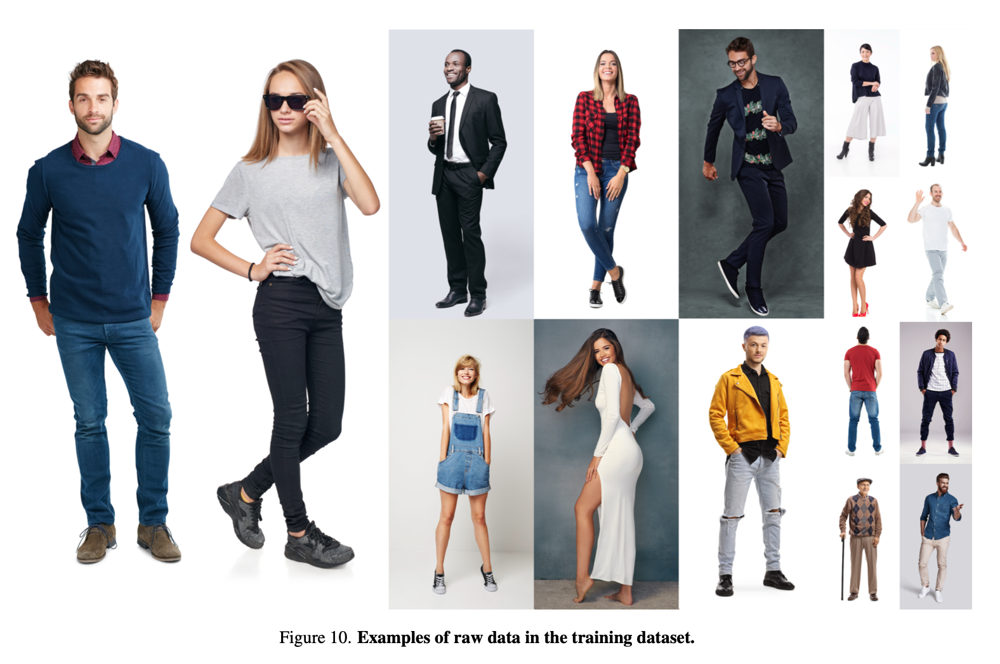

- Data comparison with other public datasets

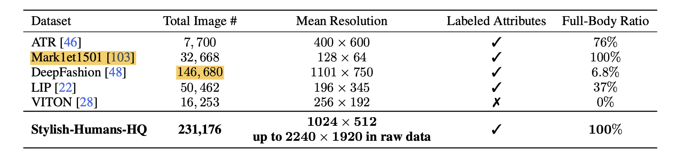

- Data preprocessing steps

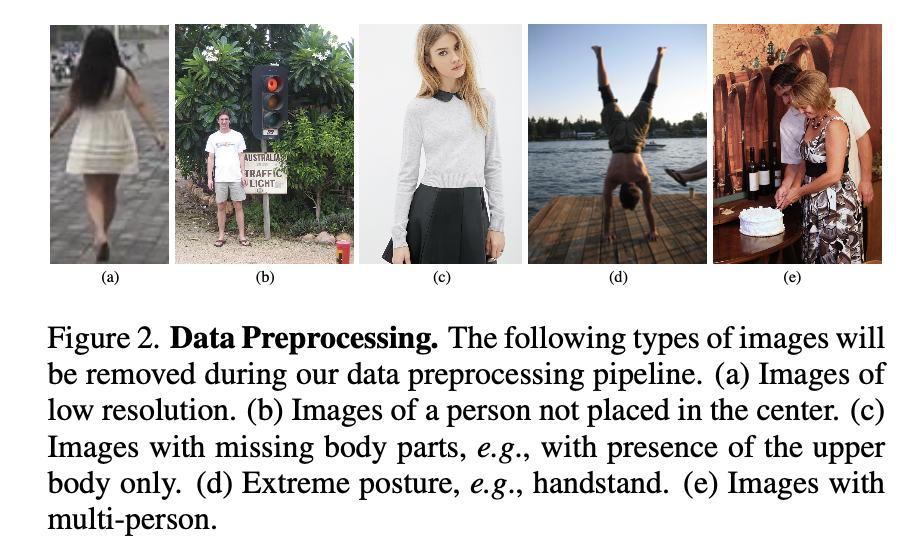

- Attributes distributions: They claim to have better representation and diversity in the dataset

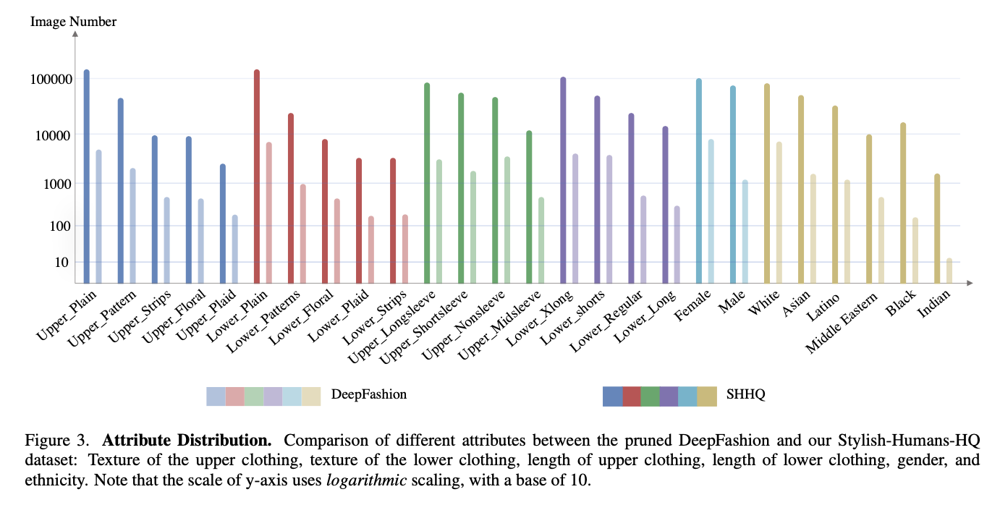

1. They have prepared the **Stylish-Humans-HQ** (SHHQ) dataset
   - About `231K` high resolution full body human images with labels
   - The training data pre-processing steps:
     - **High-resolution** images with mean resolution: `1024 X 512`
     - Images are aligned aligned such that the **body is centered** in the image
     - No **body-part occlusion** in the images
     - No extreme **human-poses**
     - No **multi-person** images
     - Elimination of complex **background**
   - The `40K` images with labels are available on request

- Raw images from the **SHHQ** dataset

- Data comparison with other public datasets

- Data preprocessing steps

- Attributes distributions: They claim to have better representation and diversity in the dataset

## **Datasize experiments**
   - Carried out uncontrolled full-body generation using StyleGAN-2
   - The experiments confirm that `ADA` improves the generation quality for datasets smaller than 40K images, in terms of FID and IS. 
   - However, ADA still cannot fully compensate for the impact of insufficient data
   - The relationship between image quality and data size is close to linear for size less than 40K.
  

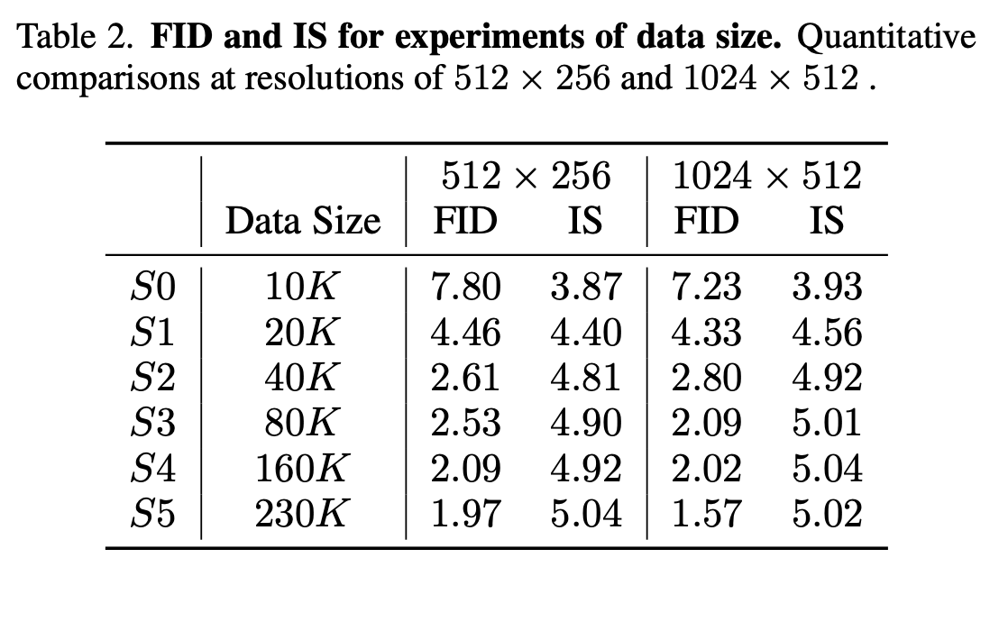

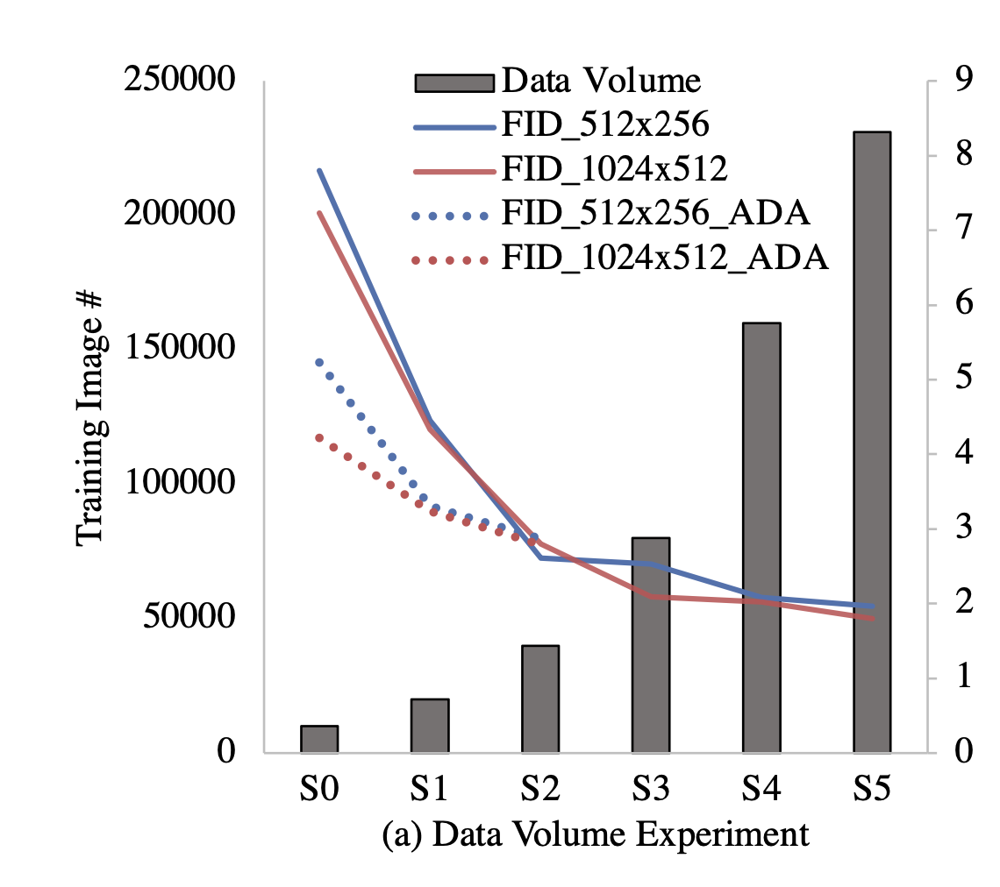

## **Data-distribution experiments**
   - The nature of GAN makes the model inherits the distribution of the training dataset and introduces gener- ation bias due to dataset imbalance
   - **Face orientation**: The uniform distribu- tion of face rotation angles helps reduce the FID of rare faces while maintaining a reasonable quality of dominant faces. (**HOW DO THEY CALCULATE FID binwise??**)
   - **Clothing texture**: Simply balancing the clothing texture distribu- tion does not effectively improve the generation quality. Note, the training samples for “plaid” clothing texture in the long-tailed experiment are too few to be learned by the model.

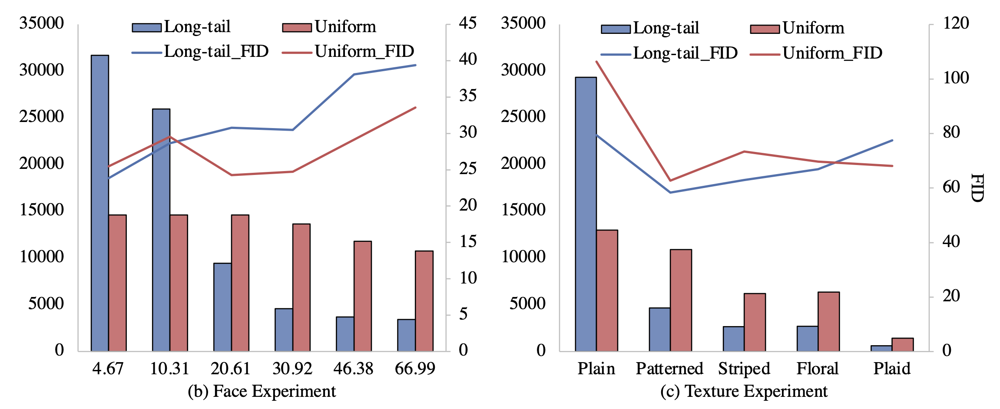

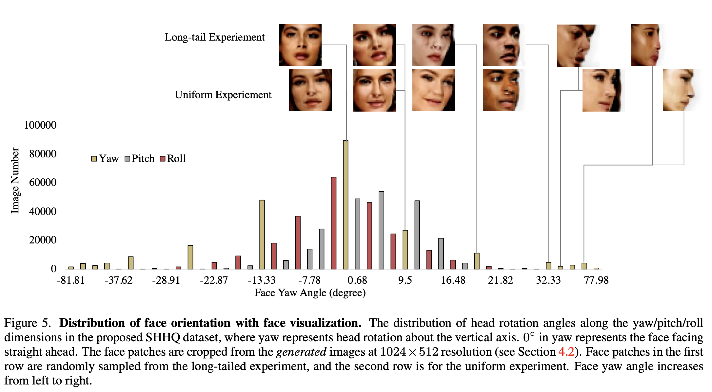

## **Data Alignment experiments**
- They randomly sample a set of `50K` images from the SHHQ dataset and align every image sep- arately using three different alignment strategies: aligning the image based on the face center, pelvis, and the midpoint of the whole body.
- The FID scores for the three alignments are as follows:
    | Alignment     | FID Score |
    | ----------- | ----------- |
    | face-aligned    | 3.5       |
    | pelvis-aligned  | 2.8        |
    | mid-body-aligned  | 2.4        |
- Both FID scores and visualizations suggest that the human generative models gain more stable spa- tial semantic information through the mid-body alignment method than face- and pelvis-centered methods.
  

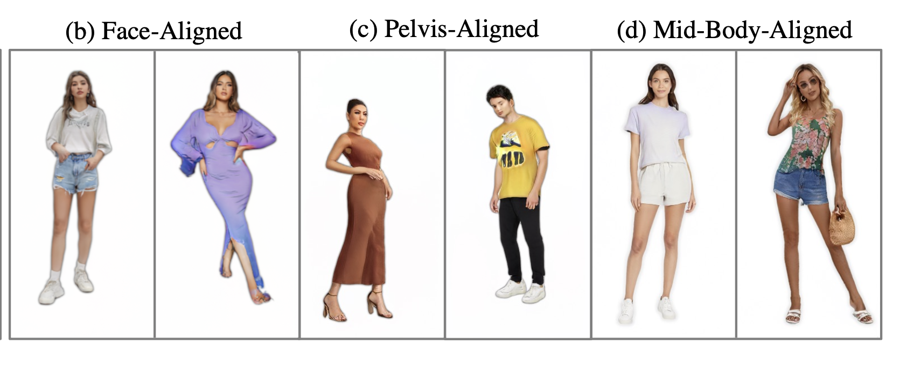

## **Style mixing results**
-  It can be seen that **low layers in the latent code control coarse features such as poses**, middle layers are related to clothing type, identical appearance, and higher layers convey fine-grained features, for example, clothing color.

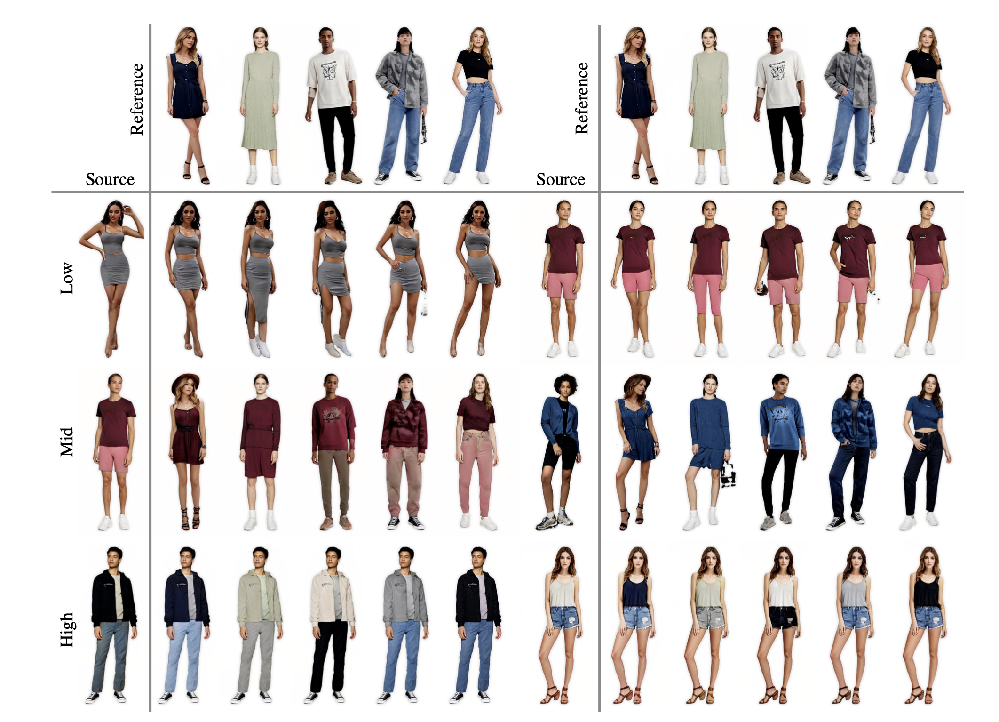

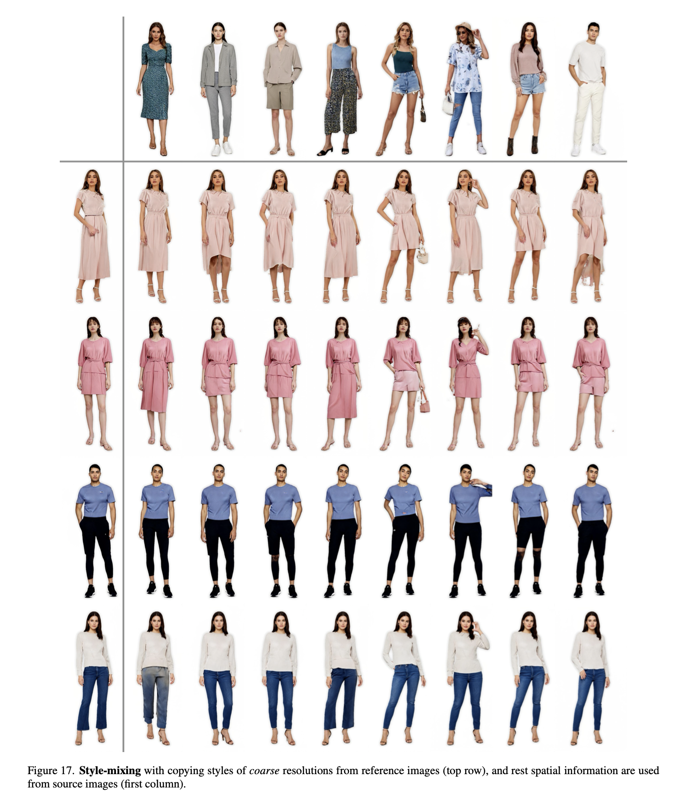

## **InsetGANs for face and body alignment**

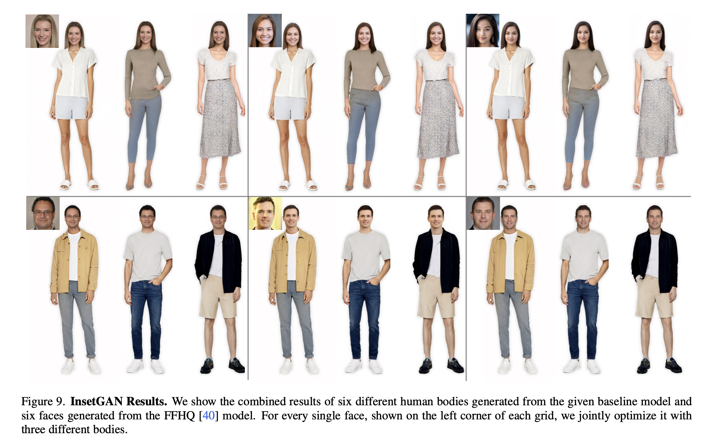

## Learnings
- Large, high-res, well-distributed, multiple-poses, ethnicities dataset will be required for any controlled/uncontrolled full-human generation
- Style-mixing in the course resolution might allow use to generate humans with multiple poses from different reference images
- For full-human generation, body alignment gives you the best results
- It is always a great idea to check the attributes and distribution of your training dataset as they does
