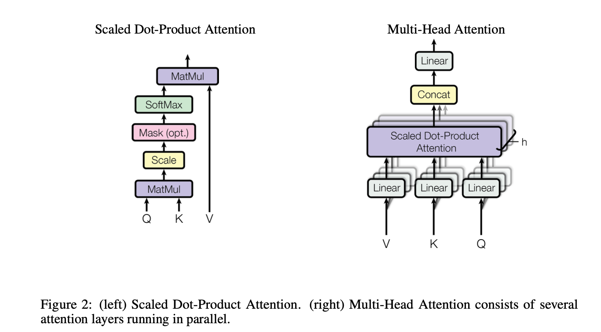
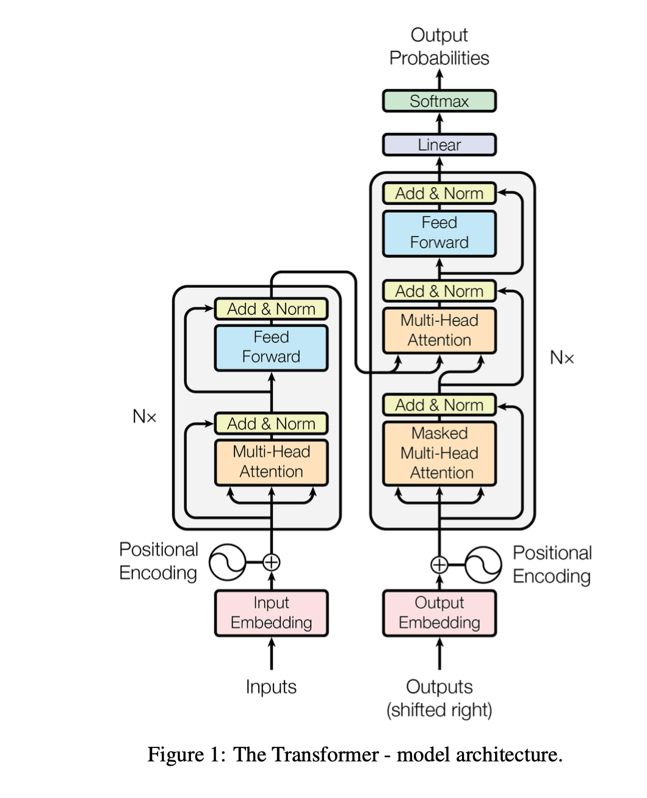

# Summary Notes

### Very very short summary
- Transformer model, only attention, delete all RNN components
- Encoder-decoder kind architecture with resnet-like connections
- Multiple head of attention in parallel
- MLP for increasing the learning even more complexity
- Layer norm (not BatchNorm!)
- Excellent hyperparemeters according to Andrej Karpathy (example, size of feed-forward layer (ffw_size=4))
- A possible contender for being a general-purpose architecture
- Ability to learn long-range dependencies
- Can be parallelized

## Summary
- The paper introduces the `Transformer` model, which relies solely on attention mechanisms for sequence modelling and transduction tasks. It dispenses the recurrence and convolutions networks entirely.

- The key concept highlighted in the paper is `attention`, which allows the model to focus on different parts of the input sequence to generate the corresponding output sequence. It enables the model to handle long-range dependencies more effectively and improve parallelization during training. 

- Mathematically, the attention mechanism is given as follows:
\[\text{{Attention}}(Q, K, V) = \text{{softmax}}\left(\frac{{QK^T}}{\sqrt{d_k}}\right)V
\]

- Here,  `K (key)`, `Q (query)` and `V (values)` are three vectors that can be thought as follows,
  -  `Q` is a feature vector that describes what we are looking for in the sequence, i.e. what would we maybe want to pay attention to.
  -  `K` is a feature vector that roughly describes what the element is “offering”, or when it might be important.
  -  `V` is a feature representation of the token/input element. This is the feature vector is the one we average over. The weights for this average are computed. 
- For every token/element, we have one `key` and one `value` vector. The `query` is compared to all keys with a score function (in this case the dot product) to determine the weights. The softmax is not visualized for simplicity. Finally, the value vectors of all words are averaged using the attention weights.

- Thus, `attention` mechanism describes,
>  "a weighted average of (sequence) elements with the weights dynamically computed based on an input query and elements keys."

- This type of attention mechanism is also called `Scaled-dot product attention` due to the way it is calculated. 
> Scaled, since we devide by $\sqrt{d_k}$ to maintain unit variance that is higher after dot product.

- The paper also introduced the notion of "multi-head attention," where multiple attention heads are used to attend to different parts of the input sequence simultaneously. By employing multiple attention mechanisms, the model can capture different types of information and learn more diverse representations. This multi-head attention mechanism contributes to the Transformer's ability to capture both local and global dependencies in a sequence.

\[
\text{{MultiHead}}(Q, K, V) = \text{{Concat}}(\text{{head}}_1, \ldots, \text{{head}}_h)W^O
\]

\[
\text{{head}}_i = \text{{Attention}}(QW_i^Q, KW_i^K, VW_i^V)
\]

- The block `Mask (opt.)` represents the optional masking of specific entries in the attention matrix. This is for instance used if we stack multiple sequences with different lengths into a batch. This helps in the parallelization in PyTorch. The masking is also used in the self-attention mechanism of the decoder part of the Transformers to allow the information flow only from previous tokens and restrict any learning from future tokens

- The attention mechanism that is used in transformers is `permutation-equivariant` with respect to its inputs. This means that if we switch two input elements in a sequence, the new sequence is still the same to the transformers, i.e. a sequence is a set of elements to the transformers. 

- Therefore, in order for the model to make use of the order of the sequence, they inject some information about the relative or absolute position of the order of the sequence by making use of `positional encodings`. They make use of sine and cosine functions of different frequencies as the positional encodings.

\[
\text{{PE}}(pos, 2i) = \sin\left(\frac{{pos}}{{10000^{2i/d_{\text{{model}}}}}}\right)
\]
\[
\text{{PE}}(pos, 2i+1) = \cos\left(\frac{{pos}}{{10000^{2i/d_{\text{{model}}}}}}\right)
\]

- These, encodings are added to the input sequence in the transformers and constitutes as the position information.

- The `Transformer model` introduced in the paper contains  consists of an encoder and a decoder. 

- The encoder processes the input sequence, while the decoder generates the output sequence. 

- Both encoder consists of multiple multi-head attention blocks. In each block, multi-head attention is followed by layer norm, a MLP layer and final layer normalization. 

- The Layer Normalization plays an important role in the Transformer architecture as it enables faster training and provides small regularization. Additionally, it ensures that the features are in a similar magnitude among the elements in the sequence. 
> Batch Normalization has shown to perform particularly bad in language as the features of words tend to have a much higher variance (there are many, very rare words which need to be considered for a good distribution estimate)

- The MLP adds extra complexity to the model and allows transformations on each sequence element separately. It allows the model to “post-process” the new information added by the previous layers.
  

- Similar to ResNets, Transformers are designed to be very deep.  Hence, the residual connections are crucial for enabling a smooth gradient flow through the model.
> Without the residual connection, the information about the original sequence is lost. Remember that the Multi-Head Attention layer ignores the position of elements in a sequence, and can only learn it based on the input features. Removing the residual connections would mean that this information is lost after the first attention layer (after initialization), and with a randomly initialized query and key vector, the output vectors for position has no relation to its original input.

- Note, there are three type of attention that is applied in the Transformer model
  - The encoder uses `self-attention` mechanism with `QKV` coming from the same input with no masking and information from both leftward and rightwards.
  - The decoder uses `self-attention` mechanism with `QKV` coming from the same input. However, there is a masking done to avoid the information flow from rightwards (or future).
  - The third is the `cross-attention` where `Q` come from the previous decoder layer, and the `K` and `V` come from the output of the encoder. This allows every position in the decoder to attend over all positions in the input sequence.

- To evaluate the Transformer model, the authors conducted extensive experiments on machine translation tasks, achieving state-of-the-art results on the WMT 2014 English-to-German and English-to-French benchmarks. The Transformer model exhibited superior performance compared to previous models while being more parallelizable and requiring less training time.
  
- Note, the self-attention mechanism used here has approx. unit maximum path length that allows the information not to be lost/forgotten over the large-sequences. 

## Acknowledgments
- Transformers United 2023: Introduction to Transformers w/ Andrej Karpathy: https://www.youtube.com/watch?v=XfpMkf4rD6E
- Original paper: https://arxiv.org/abs/1706.03762